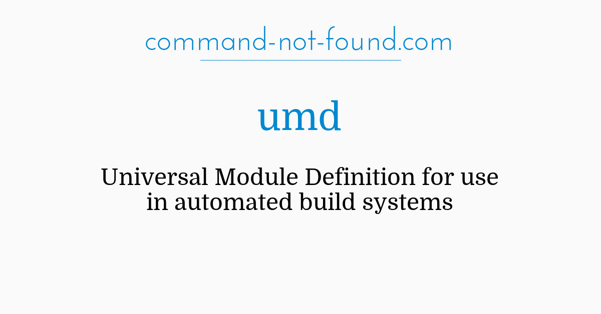

# 1. JavaScript 모듈


## 1.1. 모듈의 부재

JavaScript는 과거 인터넷 브라우저 회사였던, Netscape의 Brendan Eich(브렌던 아이크)에 의해 만들어졌다. 처음에는 Mocha라는 이름으로 개발되었으며, 나중에 이어서 LiveScript -> JavaScript로 이름이 변경되었다.

그런데 Eich가 처음 JavaScript를 만들 때, 이를 [웹 디자이너와 파트타임 개발자가 소통할 수 있는 언어](https://webdevelopmenthistory.com/1995-the-birth-of-javascript/)정도로 여겼다고 한다😲. 따라서 JavaScript가 진정한 프로그래밍 언어로 거듭나기 위해서는 몇 가지 부족한 부분을 메꿔야했는데, 그 중 하나가 바로 모듈 시스템이다.

> Eich saw JavaScript at the time as “a ‘glue language’ for the Web designers and part time programmers who were building Web content from components such as images, plugins, and Java applets.”

## 1.2. 모듈의 필요성

프로젝트의 확장성을 위해서는 모듈 시스템이 반드시 필요하다. 따라서 대부분의 언어가 모듈 기능을 기자고 있다. C언어는 `#include` 자바와 파이썬은 `import`로 구현되었다. 더 구체적인 이유를 설명하면 다음과 같다.

1. **전역 스코프 관리**  
   모듈시스템이 없으면 **변수가 전역스코프에 선언**된다. 따라서 아래와 같이 변수명이 중복될 경우, 나중에 선언된 변수가 이전 변수를 덮어씌운다.

   ```html
   <!DOCTYPE html>
   <html>
     <head>
       <script src="./foo.js"></script>
       <script src="./bar.js"></script>
       <script>
         console.log('x =', x)
       </script>
     </head>
     <body>
       ...
     </body>
   </html>
   ```

   ```js
   // foo.js
   var x = 'foo'
   ```

   ```js
   // bar.js
   var x = 'bar'
   ```

   

2. **의존성 관리**  
   또한 모듈 시스템이 없으면 **함수 간 의존성을 직접 관리**해야 한다. 예를 들어 아래와 같이 스크립트 로드 순서가 맞지 않아, 선언되지 않은 함수를 사용하려고 할 경우 에러가 발생한다.

   ```html
   <!DOCTYPE html>
   <html>
     <head>
       <script src="./sum_3_5.js"></script>
       <script src="./sum.js"></script>
     </head>
     <body>
       ...
     </body>
   </html>
   ```

   ```js
   // sum_3_5.js
   console.log('3 + 5 =', sum(3, 5))
   ```

   ```js
   // sum.js
   function sum(a, b) {
     return a + b
   }
   ```

   

## 1.3. 모듈의 조건

위의 내용을 바탕으로 모듈 시스템이 갖춰야할 조건을 정리하면 아래와 같다. 이제부터 설명할 모듈 시스템들은 모두 아래 조건을 만족했다.

1. 각 모듈은 **독립적인 스코프**를 가져야 한다. 즉 전역스코프를 오염해선 안된다.
2. **모듈 간의 의존성**이 관리되어야한다. 즉 하나의 모듈이 다른 모듈을 참조할 때, 모듈 간의 로드 순서가 보장되어야 한다.
3. **시멘틱하게 임포트**할 수 있어야 한다. 즉 모듀를 로드할 때 이름을 새롭게 지을 수 있어야 한다.

# 2. commonJS


## 2.1. 역사

어느 날 Mozilla의 개발자 Kevin Dangoor가 ['JavaScript가 서버 사이드 언어가 되기 위해서 필요한 것들'이라는 제목의 글](https://www.blueskyonmars.com/2009/01/29/what-server-side-javascript-needs/)을 올렸다. 그리고 여기에 공감한 개발자들이 모여 commonJS라는 첫 자바스크립트 모듈 시스템을 탄생시킨다.

자바스크립트의 표준을 정의하는 ECMAScript와 연계하지 않았기 때문에, 자바스크립트의 공식적인 모듈 시스템이 아니었다. 하지만 Node.js라는 아주 유-명한 런타임 환경이 commonJS 명세를 채택했기 때문에, 오랜 기간 "사실상 표준"으로 여겨졌다.

## 2.2. 문법

- **모듈의 선언**  
  **한 개의 파일에서 한 개의 객체**가 선언된다. 다음 두가지 방법으로 객체의 프로퍼티를 지정할 수 있다.

  ```js
  // 한 개 객체 내보내기
  const math = {
    num: 1,
    sum: function (a, b) {
      console.log(a + b)
    },
    sub: function (a, b) {
      console.log(a - b)
    },
  }

  module.exports = math
  ```

  ```js
  // 각각의 프로퍼티 내보내기
  exports.num = 1
  exports.sum = function (a, b) {
    console.log(a + b)
  }
  exports.sub = function (a, b) {
    console.log(a - b)
  }
  ```

- **모듈의 사용**  
  전체 객체를 바로 변수에 할당하거나, 구조 분해 할당(Destructing)해서 사용할 수도 있다.

  ```js
  const obj = require('./bar.js')

  console.log(obj.num) // 1
  obj.sum(1, 2) // 3
  obj.sub(1, 2) // -1
  ```

  ```js
  const { num, sum, sub } = require('./foo.js')

  console.log(num) // 1
  sum(1, 2) // 3
  sub(1, 2) // -1
  ```

## 2.3. 한계점

<mark>commonJS는 동기적으로 모듈을 로드한다.</mark> [Kevin Dangoor가 쓴 글](https://www.blueskyonmars.com/2009/01/29/what-server-side-javascript-needs/)의 제목에서부터 알 수 있듯이 **서버를 위한 모듈 시스템**이다. 이름조차 원래 serverJS 였다고 한다. 그로 인한 한계점이 바로 동기적으로 모듈을 로드한다는 것이다. 이는 **브라우저에게 아주 부적합한 방식**이었다.

서버에서는 보통 모듈이 파일시스템에 존재한다. 아무리 파일을 읽는게 I/O작업이라고 해도 **네트워크 통신보야 훨씬 빠르다**. 또한 서버 프로세스는 한 번 실행되면 오랫동안 메모리에 머무르기 때문에 **여러번 모듈을 로드할 필요가 없다**. 반면 브라우저은 새로고침할때마다 모듈을 새로 로드해야한다.

# 3. AMD (Asynchronous Module Definition)


## 3.1. 역사

commonJS에서 비동기 모듈 로딩에 대한 합의점을 찾지 못한 그룹이 나와 AMD를 만든다. 따라서 당연히 **비동기 모듈 로딩**을 지원한다. 또한 commonJS에서 분리된 만큼 똑같이 `require`함수를 사용하는 등의 공통점이 있다.

그런데 AMD를 사용하기 위해서는 **별도의 라이브러리를 사용**해야한다. 안타깝지만 어디서도 AMD를 공식적으로 지원하지 않기 때문이다. 그 중 가장 <b>대표적인 것이 [requireJS](https://requirejs.org/)</b>이다. AMD 모듈을 사용하기 위한 `define()`과 `require()`함수가 이러한 라이브러리에 정의되어 있다.

## 3.2. 문법

- **모듈의 선언**  
  모듈을 선언할 때, 의존하는 모듈들을 비동기적으로 로드한다.

  ```js
  // 의존성이 없을 경우
  define([], function () {
    return {
      sum: function (a, b) a + b,
    }
  })
  ```

  ```js
  // 의존성이 있을 경우
  define(['sum'], function (sum) {
    return {
      sub: function (a, b) {
        return sum.sum(a, -b)
      },
    }
  })
  ```

- **모듈의 사용**  
  모듈을 사용할 때, 사용하고자 하는 모듈을 비동기적으로 로드한다.

  ```js
  require(['sub'], function (sub) {
    console.log(sub.sub(5, 2))
  })
  ```

- **html 예시**  
  AMD 모듈을 사용하기 위해서는, requireJS처럼 AMD 스펙이 구현된 라이브러리를 전역적으로 선언해야 한다.

  ```html
  <!DOCTYPE html>
  <html lang="en">
    <head>
      <meta charset="UTF-8" />
      <meta name="viewport" content="width=device-width, initial-scale=1.0" />
      <title>Document</title>
      <!-- requireJS 라이브러리  -->
      <script src="https://cdnjs.cloudflare.com/ajax/libs/require.js/2.3.6/require.min.js"></script>
      <!-- AMD 방식의 모듈 사용 -->
      <script>
        require(['./sub'], function (sub) {
          console.log(sub.sub(5, 2))
        })
      </script>
    </head>
    <body></body>
  </html>
  ```

  

## 3.3. 한계점

<mark>공식적으로 지원하는 환경이 없다.</mark> ECMAScript와 Node.js를 포함하여 AMD를 공식적으로 지원하지 않기 때문에, AMD를 사용하기 위해서는 requireJS와 같이 **AMD 스펙이 구현된 라이브러리를 먼저 전역적 스코프에 선언**해야한다.

<mark>이미 대부분의 라이브러리가 commonJS로 작성되어 있었다.</mark> npm에는 이미 많은 라이브러리들이 commonJS로 배포되어 있었다. 따라서 해당 라이브러리들을 AMD 형식으로 사용하기 위해서는, 각 개발자들이 라이브러리를 다시 한번 AMD모듈 형식으로 선언해주길 바래야했다.

# 4. UMD (Universal Module Definition)



## 4.1. 역사

UMD는 모듈 시스템은 아니고, 개발자 커뮤니티에서 채택된 **모듈 선언 패턴**이다. 해당 패턴으로 모듈을 선언하면, 다양한 모듈시스템에서 임포트해서 사용할 수 있다. [UMD.js](https://github.com/umdjs/umd)에서는 다양한 환경에 대한 템플릿을 제공한다.

## 4.2. 문법

- **모듈의 선언**  
   UMD 패턴은 **즉시 실행 함수**로 구현할 수 있다. 모듈이 로드되는 시점에 `if`조건문을 실행해서 모듈시스템을 파악한다. 그리고 모듈시스템에 따라 대응되는 방식으로 모듈을 선언한다. 아래는 대표적인 UMD 패턴의 한 예시이다.

  ```js
  /* prettier-ignore */

  // 즉시 실행 함수
  // 첫번째 인자로 전역 객체, 두번째 인자로 실제 코드 내용을 받는다
  (function (root, factory) {
    if (typeof define === 'function' && define.amd) {
      // AMD 환경
      define(['./sum'], factory)
    } else if (typeof exports === 'object') {
      // CommonJS 환경
      module.exports = factory(require('./sum'))
    } else {
      // 브라우저 환경
      root.sub = factory(root.sum)
    }
  })(typeof self !== 'undefined' ? self : this, function (sum) {
    // 실제 코드 내용
    function sub(a, b) {
      return sum.sum(a, -b)
    }
  
    return {
      sub: sub,
    }
  })
  ```

# 5. ESM (ECMAScript Modules)


## 5.1. 역사

2015년 6월, ES6와 함께 ESM이 등장했다. ECMAScript가 만들었기 때문에 **자바스크립트의 공식적인 모듈시스템**이 된 것은 물론이고, **현재 모든 브라우저**와 **14버전 이후의 Node.js**가 공식적으로 ESM을 지원한다. 앞으로 ESM이 자바스크립트의 표준 모듈시스템으로 자리매김 할 것이다.

## 5.2. 문법

- **모듈의 선언**  
  **한 개의 파일에서 한 개의 객체**가 선언된다. 다음 두가지 방법으로 객체의 프로퍼티를 지정할 수 있다.

  ```js
  // 한 개 객체 내보내기
  const math = {
    num: 1,
    sum: function (a, b) {
      console.log(a + b)
    },
    sub: function (a, b) {
      console.log(a - b)
    },
  }

  export default math
  ```

  ```js
  // 각각의 프로퍼티 내보내기
  export const num = 1
  export function sum(a, b) {
    console.log(a + b)
  }
  export function sub(a, b) {
    console.log(a - b)
  }
  ```

- **모듈의 사용**  
  전체 객체를 바로 변수에 할당하거나, 구조 분해 할당(Destructing)해서 사용할 수도 있다.

  ```js
  import obj from './foo.mjs'

  console.log(obj.num) // 1
  obj.sum(1, 2) // 3
  obj.sub(1, 2) // -1
  ```

  ```js
  import { num, sum, sub } from './bar.mjs'

  console.log(num) // 1
  sum(1, 2) // 3
  sub(1, 2) // -1
  ```

## 5.3. 동적 로딩

때때로 ESM이 동적 모듈을 지원하지 않는다는 글을 보았는데, 그렇게 말하는 이유를 모르겠다. ESM도 commonJS와 마찬가지로 **동적 모듈 로딩(dynamic import) 기능을 지원**한다.

`import()`함수는 Promise객체를 반환한다. 모듈을 성공적으로 로드되면, 로드된 모듈을 `then` 체이닝의 인자로 넘겨다.

```js
import('./myModule.js')
  .then((module) => {
    const result = module.someFunction()
    console.log(result)
  })
  .catch((error) => {
    console.error(error)
  })
```

# 8. 참고자료

- [Chullin: 웹팩(3/4); JS모듈화 역사 돌아보기(1)](https://medium.com/@chullino/%EC%9B%B9%ED%8C%A9-3-4-js%EB%AA%A8%EB%93%88%ED%99%94-%EC%97%AD%EC%82%AC-%EB%8F%8C%EC%95%84%EB%B3%B4%EA%B8%B0-1-9df997f82002)
- [짐코딩: 자바스크립트 모듈 시스템 | ES 모듈 | CommonJS 모듈](https://www.youtube.com/watch?v=5NXEXkIrkAk)
- [Kevin Dangoor: what-server-side-javascript-needs](https://www.blueskyonmars.com/2009/01/29/what-server-side-javascript-needs/)
- [blog.rhostem.com: UMD(Universal Module Definition) 패턴](https://blog.rhostem.com/posts/2019-06-23-universal-module-definition-pattern)
