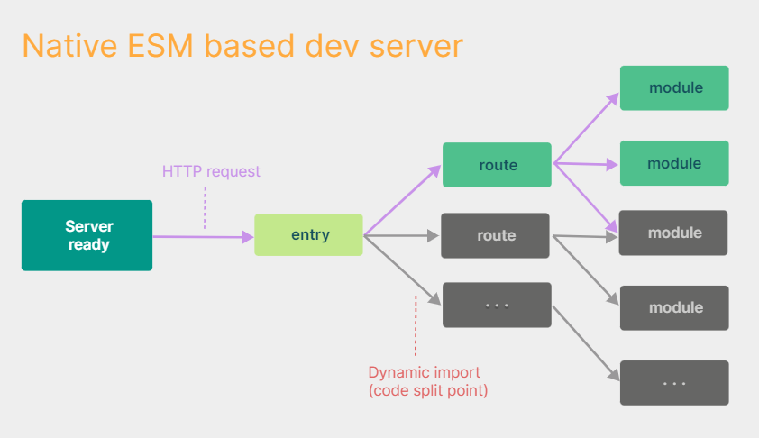

# 1. 번들러

## 1.1. 번들러란?

<mark>번들러는 여러 자바스크립트 모듈 간의 관계를 분석하여 하나의 자바스크립트 파일로 만드는 도구이다.</mark> 반드시 하나의 자바스크립트 파일일 필요는 없고, 원한면 몇 개로 나눌 수도 있다. 이를 <b>코드 스프리팅(Code Splitting)</b>이라고 말한다.

그리고 css, html, 이미지 파일은 들러리일 뿐이다. '자바스크립트 번들링하는 김에 너네도 해줄게!' 이런 느낌이다. 때문에 자바스크립트 외의 파일을 번들링하기 위해서는, 별도의 로더를 번들러에 추가해줘야 한다.

## 1.2. 번들러의 아주 간단한 역사

- **Grunt / Gulp / Google Closure Compiler**  
  이들은 번들러는 아니고, <b>태스크 러너(task runner)</b>로 처음 만들어졌다. 파일 복사, 코드 압축, CSS 전처리와 같이 빌드에 필요한 작업을 수행한다. 대부분의 **현대 번들러는 이들 작업을 포함**한다.

- **Browserify (2011)**  
  **최초의 번들러**라고 할 수 있다. commonJS가 대표 모듈 시스템으로 자리 잡았을 때, '클라이언트측을 위한 모듈 시스템이 없다면, 그냥 미리 하나로 합쳐버리면 되지!'라는 혁신적인 아이디어와 함께 등장했다. 현재 번들러와 개념이 거의 동일하다.

- **Webpack (2012)**  
  **현재 가장 대표적인 번들러**이다. 거대한 생태계와 플러그인을 자랑하기 때문에, 세세한 커스터마이징이 가능하다. 그만큼 설정이 복잡하다는게 단점이다.

- **Rollup / Snowpack / Parcel**  
  각각 웹팩과는 다른 장단점을 가지고 있다. 어디선가 webpack이 번들러의 춘추전국시대를 마무리 지었다는 글을 보았는데, 내 생각에는 그 반대 같다.

- **esbuild (2020)**  
  esbuild는 아직 공식적인 v1.0이 나오지 않았음에도, **엄청나게 빠른 빌드 속도**로 주목을 받고 있다. Go 언어로 작성되어 멀티스레드(고루틴)로 동작하기 때문에, JavaScript 싱글스레드로 구현된 다른 번들러보다 월등히 빠르다.

# 2. Webpack vs Rollup

## 2.1. 개요

Webpack과 Rollup 어떤 번들러를 선택하든지간에 **설정만 잘해주면 원하는 결과물**을 얻을 수 있다. 다만 각각의 장단점이 있을 뿐이다. 보통 어플리케이션 만들 때는 Webpack을 사용하고, 패키지나 라이브러리를 만들 때는 Rollup을 사용한다고 한다. 추가로 [tooling.report 페이지](https://bundlers.tooling.report/)에서 각 번들러의 평가 지표를 볼 수 있다.

## 2.2. 비교

Alexey님의 [Head-to-Head: Rollup vs Webpack Analysis](https://moiva.io/?npm=rollup+webpack#:~:text=Rollup%20is%20generally%20faster%20than,build,%20especially%20for%20larger%20projects.)글을 거의 베끼다시피해서 작성했다.

- **설정**  
  웹팩이 보다 다양하고 복잡한 기능을 제공하는 만큼 설정이 더 복잡하다. 반면 롤업은 단순성에 중점을 두기 때문에 더 간편한게 설정할 수 있다.
- **번들 사이즈**  
  일반적으로 롤업이 웹팩에 비해 더 작은 번들 크기를 생성한다. 이는 롤업이 더 뛰어난 트리쉐이킹 기능을 제공하기 때문이다.
- **코드 분할**  
  웹팩이 더 뛰어난 코드분할 기능을 제공한다. 롤업 또한 코드 분할 기능이 있지만 웹팩에 비해 제한적이다.
- **모듈 시스템**  
  웹팩은 다양한 모듈 시스템과 호환된다. 롤업은 ESM모듈에 더 특화되어 있지만, 플러그인을 설치해서 다른 모듈 시스템과도 호환 가능하다.
- **빌드 속도**  
  일반적으로 롤업이 웹팩보다 빌드 시간이 빠릅니다. 이는 롤업의 빌드 프로세스가 더 간단하기 때문이다.

# 3. Vite

아래 내용은 **Vite 4버전**을 기준으로 작성되었다. Vite는 엄밀히 말해서 번들러가 아니라 빌드도구이다. 그리고 번들링 기능을 제공하기 위해서 다른 번들러를 사용한다. 개발서버를 위한 **사전번들링에서는 esbuild를**, 배포를 위한 **번들링에서는 Rollup을** 사용한다.

## 3.2. Vite 개발 서버

Vite의 개발서버는 매우 특이하게 동작한다. 일단 다른 번들러와 다르게 **개발서버에서는 번들링을 하지 않는다**. 다만 사전 번들링이라는 이름으로 최소한의 작업을 진행한다.

### 3.2.1. 브라우저 모듈 시스템

번들링을 하지 않으면 도대체 어떻게 자바스크립트 모듈을 분석할까? 바로 **브라우저의 자체 모듈 시스템 기능**을 사용한다. ES6에서 ESM이 발표된 이후로 모든 브라우저가 모듈시스템을 지원한다. 따라서 Vite는 그냥 최초 진입점만 알려주고, 나머지는 브라우저에게 맡기는 것이다. 번들링이 일어나지 않기 때문에 **매우 빠르게 개발서버를 띄울 수 있다**.

### 3.2.2 사전 번들링 작업

그럼에도 개발서버를 띄우기 전에, 사전 번들링이라는 최소한의 작업을 수행한다. 이 과정은 **esbuild를 이용해서 매우 빠르게 진행**된다.

- **ESM 모듈화**  
  브라우저는 ESM 모듈만을 지원한다. 따라서 commonJS 방식으로 선언된 모듈이 있다면 이를 ESM 모듈 형식으로 바꿔줘야 한다.

- **모듈 단순화**  
   `lodash-es`와 같은 라이브러리는 내부 모듈이 600개이다. 따라서 번들링 없이 그냥 사용한다면 600번의 HTTP요청이 발생한다. 아무리 로컬 서버에서 띄운다고 하더라도, 지나치게 많은 비동기 요청은 성능을 저하시킨다. 따라서 Vite는 많은 내부 모듈을 하나의 모듈로 단순화하는 작업을 진행한다.

## 3.2. Vite 배포 번들링

배포 시에는 **Rollup으로 번들링**한다. 왜 개발 서버처럼 브라우저의 모듈시스템을 사용하지 않을까? 왜냐하면 배포환경에서는 모듈 로딩에 많은 비용이 들어가기 때문이다. 개발 서버는 로컬 컴퓨터에서 바로 모듈을 받아올 수 있기 때문에, 네트워크 비용이 거의 들지 않는다. 반면 배포환경에서는 네트워크 비용이 발생하기 때문에 번들링하여 자바스크립트 파일 갯수를 줄이는 것이 좋다.

'왜 esbuild를 사용하지 않냐?'라는 문의도 있았던 것 같은데, 아직 esbuild가 다양한 애플리케이션 빌드를 지원할만큼 충분히 유연하지 않기 때문이란다. 추후 esbuild가 충분히 성장하면 적용할 것이라고 [공식문서](https://ko.vitejs.dev/guide/why.html#why-not-bundle-with-esbuild)에 가능성을 열어두었다.

# 4. 참고자료

- [Vite: Vite를 사용해야 하는 이유](https://ko.vitejs.dev/guide/why.html)
- [Vite: Dependency Pre-bundling](https://vitejs.dev/guide/dep-pre-bundling.html)
- [Head-to-Head: Rollup vs Webpack Analysis](https://moiva.io/?npm=rollup+webpack#:~:text=Rollup%20is%20generally%20faster%20than,build%2C%20especially%20for%20larger%20projects.)
- [지그재그의 개발 블로그: JavaScript 번들러로 본 조선시대 붕당의 이해](https://yozm.wishket.com/magazine/detail/1261/)
- [Tooling.Report](https://bundlers.tooling.report/)
