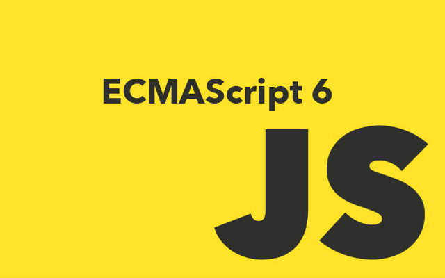
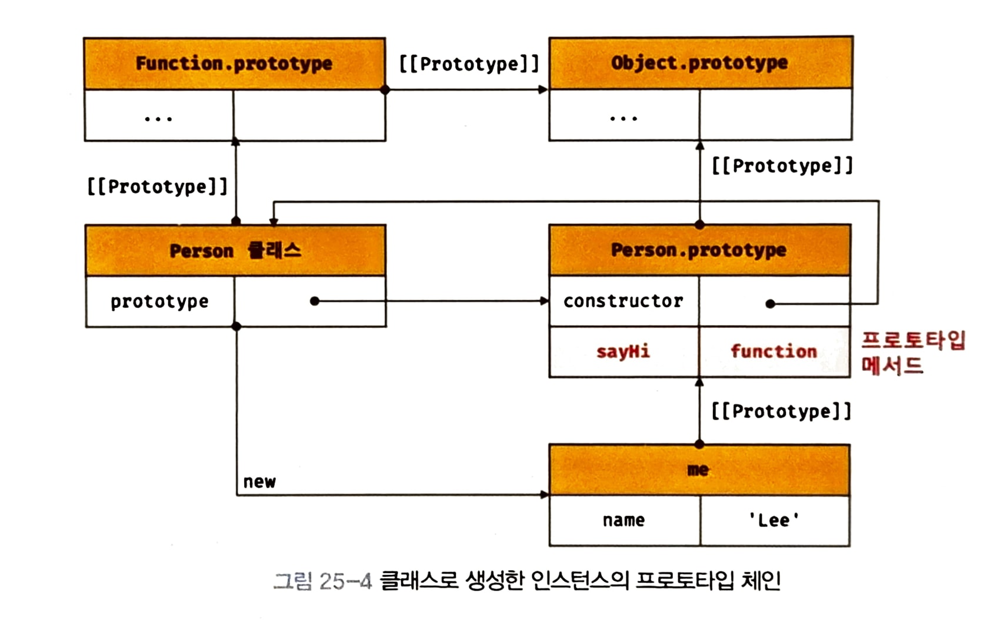
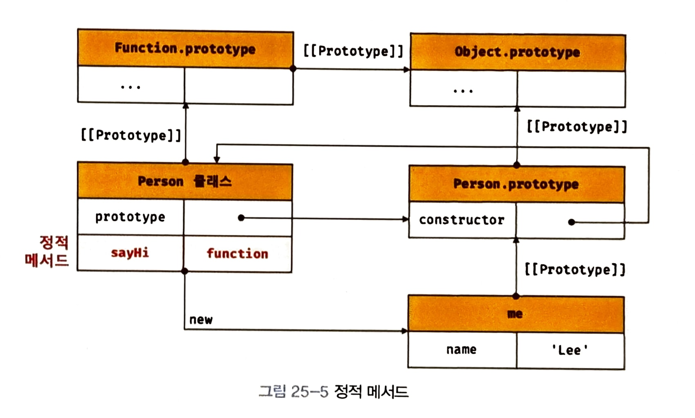
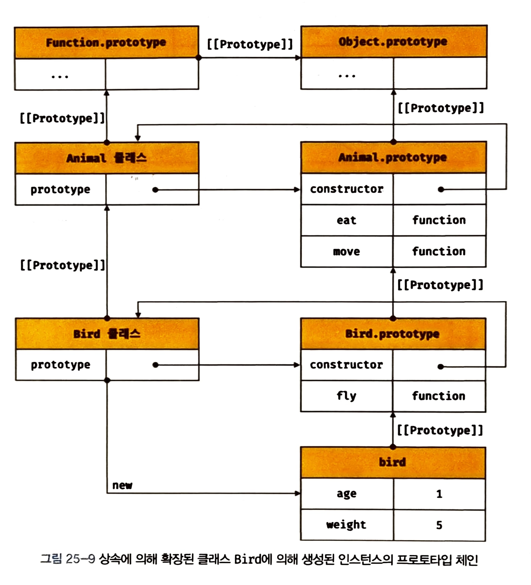

# 1. 클래스란?



## 1.1. 정의

자바스크립트의 클래스를 흔히 **문법적 설탕(synthetic sugar)**라고 표현하기도 하고, **새로운 객체 생성 패턴**이라 말하기도 한다. 이러한 장황한 수식언이 붙는 까닭은 원래 자바스크립트가 **프로토타입 기반 객체지향언어**이기 때문이다. 시작이 미약하여 자바스크립트 다른 객체지향언어들과 어딘가 달랐다. 이에 다른 객체지향언어(Java, Python, ...)를 사용하는 개발자들이 사용에 어색함을 느꼈고, ECMAScript가 ES6에서 클래스 문법 도입하기에 이르렀다.

덕분에 이제 자바스크립트도 다른 언어들과 아주 유사한 문법으로 객체 지향 프로그래밍할 수 있게 되었다. 하지만 그렇게 보이는 것일 뿐, 여전히 내부 동작은 프로토타입에 기반한다. 따라서 자바스크립트의 객체지향을 제대로 이해하기 위해서는 **프로토타입에 대한 이해가 선행**되어야 한다. 마침 여기에 누군가가 [프로토타입을 잘 정리한 글](https://byongho96.github.io/TIL/posts/Language/JavaScript/prototype/)이 있다.

## 1.2. 특징

자바스크립트의 class는 기존 생성자 함수와 다음과 같은 차이가 있다.

- 클래스는 `new` 키워드 없이 호출하면 에러가 발생한다.
- 클래스는 상속을 지원하는 `extends`와 `super`키워드를 지원한다.
- 클래스는 Temporal Dead Zone(일시적 사각 지대)를 가져 호이스팅이 발생하지 않는 것처럼 보인다.
- 클래스 내의 모든 코드에는 암묵적으로 strict mode가 적ㅇㅇ된다.

## 1.3. 기본 사용법

간단하게 다음과 같이 선언하고 사용할 수 있다. 얼핏 봐도 다른 언어들과 문법이 비슷하다.

```js
class Person {
  constructor(name) {
    this.name = name
  }

  sayHi() {
    console.log(`Hi! I'm ${this.name}`)
  }

  static syHello() {
    console.log('Hello!')
  }
}

const lee = new Person('Lee')

console.log(lee.name) // Lee
lee.sayHi() // Hi! I'm Lee
Person.sayHello() // Hello!
```

# 3. 메소드

메소드란 **클래스 내부에 정의된 함수**를 말한다. constructor(생성자), 프로토타입 메소드, 정적 메소드가 있다.

## 3.1. constructor

constructor는 인스턴스를 생성하고 초기화하는 특별한 함수이다. constructor는 최종적으로 메서드로 해석되는 것이 아니라 클래스가 평가되어 생성한 함수 객체의 일부가 된다. 한마디로 **constructor가 곧 생성자 함수로 동작**한다. 아래의 두 코드는 `new`키워드로 실행 시 동일하게 동작한다.

```js
// 클래스
class Person {
  // 생성자
  consturctor(name) {
    this.name = name
  }
}

// 생성자 함수
function Person(name) {
  this.name = name
}
```

### 3.1.1. 사용

constructor로 생성할 **객체의 속성을 초기화**할 수 있다. constructor에 매개변수를 선언하고, 인스턴스를 생성할 때 초깃값을 인자로 전달하면 constructor에 전달된다. 또한 constructor는 생성자 함수와 같이 암묵적으로 `this`에 빈 객체를 선언하고, 이를 반환한다.

```js
class Person {
  constructor(name, address) {
    // 암묵적으로 this를 선언하고 빈 객체를 할당한다
    // this = {}

    this.name = name
    this.address = address

    // 암묵적으로 this를 반환한다
    // return this
  }
}

const me = new Person('Lee', 'Seoul')
console.log(me) // Person {name: "Lee", address: "Seoul"}
```

### 3.1.2. 특징

- **이름을 변경할 수 없다.**  
  클래스의 생성자 이름은 contructor로 고정되어 있다.
- **클래스 내 최대 하나까지만 존재할 수 있다.**  
  클래스가 2개 이상이라면 문법 에러(SyntaxError)가 발생한다.

  ```js
  class Person {
    constructor() {}
    constructor() {}
  }
  // SyntaxError: A class may only have one constructor
  ```

- **constructor를 생략하면 빈 constructor가 암묵적으로 정의된다.**

  ```js
  class Person {
    // constructor() {}
  }

  const me = new Person()
  console.log(me) // Person {}
  ```

또한 생성자 함수의 특징들을 물려 받는다.

- **명시적으로 다른 객체를 반환하면 this 대신 명시한 객체가 반환된다.**

  ```js
  class Person {
    constructor(name) {
      this.name = name
      return {}
    }
  }

  const me = new Person('Lee')
  console.log(me) // {}
  ```

- **명시적으로 원시값이 반환하면 원시값 반환은 무시되고 this가 반환된다.**

  ```js
  class Person {
    constructor(name) {
      this.name = name
      return 100
    }
  }

  const me = new Person('Lee')
  console.log(me) // Person {name: 'Lee'}
  ```

## 3.2. 프로토타입 메서드

클래스 내부에 선언된 함수들은 기본적으로 프로토타임 메서드다. 다시 말해 **해당 클래스의 프로토타입 객체(`prototype`)의 메소드로 할당**되다. 그 결과 생성된 인스턴스 프로토타입 체인의 일원이 된다.

```js
class Person {
  constructor(name) {
    this.name = name
  }

  // 프로토타입 메서드
  sayHi() {
    console.log(`Hi! I'm ${this.name}`)
  }
}

const lee = new Person('Lee')
lee.sayHi() // Hi! I'm Lee
```

```js
console.dir(Object.getOwnPropertyNames(lee)) // [ 'name' ]
console.dir(Object.getOwnPropertyNames(Person.prototype)) // [ 'constructor', 'sayHi' ]
```

아래 그림처럼 프로토타입 메서드는 자동적으로 클래스의 프로토타입 객체(`prototype`)에 할당된다. 따라서 모든 인스턴스들이 프로토타입 체인으로 공유하다.

<figure>
  
  <figcaption>From 모던 자바스크립트 Deep Dive. By 이웅모.</figcaption>
</figure>

## 3.3. 정적 메서드

정적 메서드는 `static`키워드로 선언할 수 있다. 정적 메서드는 프로토타입이 아닌 **클래스 자체에 할당**된다. 그 결과 생성된 인스턴스 프로토타입 체인에 포함되지 않는다.

```js
class Person {
  constructor(name) {
    this.name = name
  }

  // 프로토타입 메서드
  static sayHi() {
    console.log('Hi!')
  }
}

Person.sayHi() // Hi!
```

아래 그림처럼 정적 메서드는 클래스에 할당된다. 따라서 **자신이 생성된 인스턴스와 다른 프로토타입 체인**을 가지게 된다. 그 결과 프로토타입 메서드와 다음과 같은 차이점을 가진다.

- 정적 메서드는 인스턴스로 호출할 수 없고, 클래스로 호출해야 한다.
- 정적 메서드는 인스턴스 프로퍼티를 참조할 수 없다.

<figure>
  
  <figcaption>From 모던 자바스크립트 Deep Dive. By 이웅모.</figcaption>
</figure>

# 4. 프로퍼티

프로퍼티란 **클래스 내부에서 정의된 변수**를 말한다. 속성/필드라는 이름으로도 부른다. 인스턴스 프로퍼티, 접근자 프로퍼티, 클래스 프로퍼티, 정적 프로퍼티가 있다.

## 4.1. 인스턴스 프로퍼티

인스턴스 프로퍼티는 constructor 내부에서 정의해야 한다. 생성자 코드 실행 전에 암묵적으로 빈 객체가 `this`에 바인딩 되기 때문에, 인스턴스 프로퍼티는 **생성된 각 인스턴스에 할당**된다.

```js
class Person {
  constructor(name) {
    this.name = name
  }
}

const lee = new Person('Lee')
console.log(lee.name) // Lee
```

## 4.2. 접근자 프로퍼티

접근자 프로퍼티는 함수이지만, 외부에서 마치 인스터스 프로퍼티처럼 사용할 수 있다. **`get`과 `set` 키워드로 서언된 함수는 각각 getter와 setter로 동작**한다. getter는 반드시 어떤 값을 반환해야하고,
setter는 반드시 단 하나의 매개변수를 받아 값을 할당해야 한다.

```js
class Person {
  constructor(firstName, lastName) {
    this.firstName = firstName
    this.lastName = lastName
  }

  get fullName() {
    return `${this.firstName} ${this.lastName}`
  }

  set fullName(name) {
    ;[this.firstName, this.lastName] = name.split(' ')
  }
}

const lee = new Person('Brian', 'Lee')
console.log(lee.fullName) // Brian Lee

lee.fullName = 'John Lee'
console.log(lee.firstName) // John
```

접근자 프로퍼티는 엄밀히 말해 함수이기 때문에 **프로토타입 프로퍼티로 할당**된다.

```js
console.dir(Object.getOwnPropertyNames(lee)) // [ 'firstName', 'lastName' ]
console.dir(Object.getOwnPropertyNames(Person.prototype)) // [ 'constructor', 'fullName' ]
```

## 4.3. 클래스 필드

이름과 다르게 클래스 필드 또한 **생성할 인스턴스의 프로퍼티**로 할당된다. 이는 원래 Java와 같은 클래스 기반 객체지향 언어에서 사용하던 용어이다.

### 4.3.1. Java

자바의 클래스 필드는 마치 **클래스 내부에서 변수처럼 `this`없이 참조**할 수 있다. 다만 클래스 필드가 생성자 또는 메서드 매개변수 이름과 동일할 때, 클래스 필드임을 명확하게 하기 위해 `this`를 사용해야 한다

```java
public class Person {
  // 클래스 필드 정의
  private String firstName = "";
  private String lastName = "";

  // 생성자
  Person(String firstName, String lastName) {
    // 매개변수 이름과 구분하기 위해 this로 클래스 필드임을 명시한다.
    this.firstName = firstName;
    this.lastName = lastName;
  }

  public String getFulName() {
    // this 없이 클래스 필드를 참조할 수 있다.
    return firstName + ' ' + lastName;
  }
}
```

### 4.3.2. JavaSript

반면 자바스크립트에서는 클래스 필드라도 **반드시 `this`를 사용해서 참조**해야한다. 클래스 필드는 초기화할 수 있으며, 초기화하지 않을 경우 `undefined`가 할당된다.

```js
class Person {
  name = 'Lee'
  constructor() {
    console.log(name) // ReferenceError: name is not defined
  }
}
```

```js
class Person {
  name
  constructor() {
    console.log(this.name) // undefined
  }
}
```

보통 클래스 필드는 **인스턴스 생성 시점에 초기화할 필요가 없는 프로퍼티**를 정의한느데 쓰인다.

```js
class Person {
  lastName = 'Lee'

  constructor(firstName) {
    this.firstName = firstName
  }
}

const brian = new Person('Brian')
console.log(brian.firstName) // Brian
console.log(brian.lastName) // Lee
```

### 4.3.3. private 필드

기본적으로 선언되는 public 필드는 어디서든 참조할 수 있지만, **private 필드는 클래스 내부에서만 참조**할 수 있다. 변수명 앞에 `#`을 붙여 선언하며, 참조할 때도 `#`을 붙여줘야 한다.

```js
class Person {
  #name = ''

  constructor(name) {
    this.#name = name
  }
}

const lee = new Person('Lee')
console.log(lee.#name) // SyntaxError: private field '#name' must be declared in an enclosing class
```

따라서 private 필드를 외부에서 제한적으로 접근하도록 하기 위해 접근자 프로퍼티를 사용한다.

```js
class Person {
  #name = ''

  constructor(name) {
    this.#name = name
  }

  get name() {
    return this.#name.trim()
  }
}

const lee = new Person(' Lee ')
console.log(lee.name) // Lee
```

## 4.3. 정적 필드

정적 메서드와 마찬가지로 클래스에 할당되는 프로퍼티이다. 따라서 클래스에서 바로 참조하여 사용할 수 있는 반면, 인스턴스에서는 참조할 수 없다.

```js
class MyMath {
  static PI = 22 / 7
}

console.log(MyMath.PI) // 3.142857142857143

myMath = new MyMath()
console.log(myMath.PI) // undefined
```

# 5. 상속

자바스크립트의 상속으로 프로토타입 체이닝을 간단하게 구현할 수 있다.

## 5.1. extends

자바스크립트 상속은 `extends`키워드로 구현할 수 있으며, 자식 클래스의 프로토타입이 부모 클래스의 프로토타입을 `__proto__`로 참조한다.

```js
class Animal {
  constructor(age, weight) {
    this.age = age
    this.weight = weight
  }

  eat() {
    console.log('eat')
  }

  move() {
    console.log('move')
  }
}

class Bird extends Animal {
  fly() {
    console.log('fly')
  }
}

const bird = new Bird(1, 5)

console.log(bird) // Bird {age:1, weight: 5}
console.log(bird instanceof Bird) // true
console.log(bird instanceof Animal) // true

bird.eat() // eat
bird.move() // move
bird.fly() // fly
```

위의 코드는 아래 그림과 같은 프로토타입 체인을 형성한다. 자식 클래스 Bird의 프로토타입 객체가 `__proto__` 부모 클래스 Animal의 프로토타입 객체를 참조하고 있다.

<figure>
  
  <figcaption>From 모던 자바스크립트 Deep Dive. By 이웅모.</figcaption>
</figure>

## 5.2. super

super 키워드는 함수처럼 호출할 수도 있고 this와 같이 식별자처럼 차조할 수 있는 트구한 키워드이다. super는 다음과 같이 동작한다.

- super를 호출하면 수퍼 클래스의 constructor가 호출된다.
- super를 참조하면 수퍼 클래스의 동일 이름 메서드를 참조한다.

### 5.2.1. super 호출

super를 호출하면 **부모 클래스의 constructor를 호출**한다. 클래스를 상속받을 때 생략된 cosntructor는 암묵적으로 super 호출을 통해 부모 클래스의 constructor를 실행시킨다.

```js
class Base {
  constructor(a, b) {
    this.a = a
    this.b = b
  }
}

class Derived extends Base {
  // 다음과 같은 constructor를 암묵적으로 정의한다.
  // constructor(...args) { super(...args) }
}

const derived = new Derived(1, 2)
console.log(derived) // Derived {a: 1, b: 2}
```

만일 자식 클래스에도 추가 초기화 과정을 진행하려면 **반드시 super를 호출하여 부모 클래스의 constructor를 실행**시켜야 한다.

```js
class Base {
  constructor(a, b) {
    this.a = a
    this.b = b
  }
}

class Derived extends Base {
  constructor(a, b, c) {
    super(a, b)
    this.c = c
  }
}

const derived = new Derived(1, 2, 3)
console.log(derived) // Derived {a: 1, b: 2, c: 3}
```

### 5.2.2. super 참조

**메소드 내에서 super를 참조하면 수퍼 클래스의 메소드를 호출할 수 있다.**

```js
class Base {
  constructor(name) {
    this.name = name
  }

  sayHi() {
    return `Hi!, I'm ${this.name}.`
  }
}

class Derived extends Base {
  greet() {
    return `${super.sayHi()} Nice to meet you`
  }
}

const derived = new Derived('Lee')
console.log(derived.greet()) // Hi! I'm Lee. Nice to meet you
```

# 6. 참고자료

- [이웅모: 모던 자바스크립트 Deep Dive, 19장 프로토타입](https://poiemaweb.com/js-prototype)
