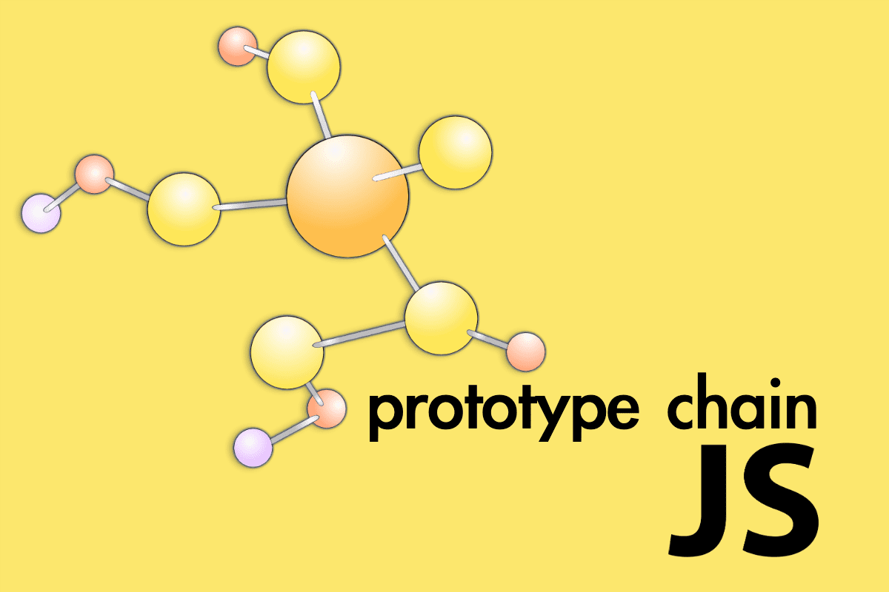
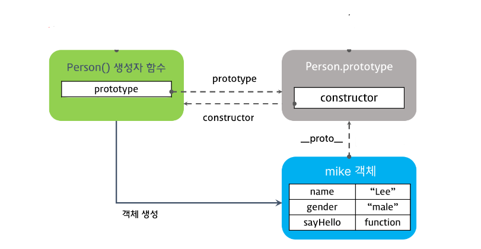
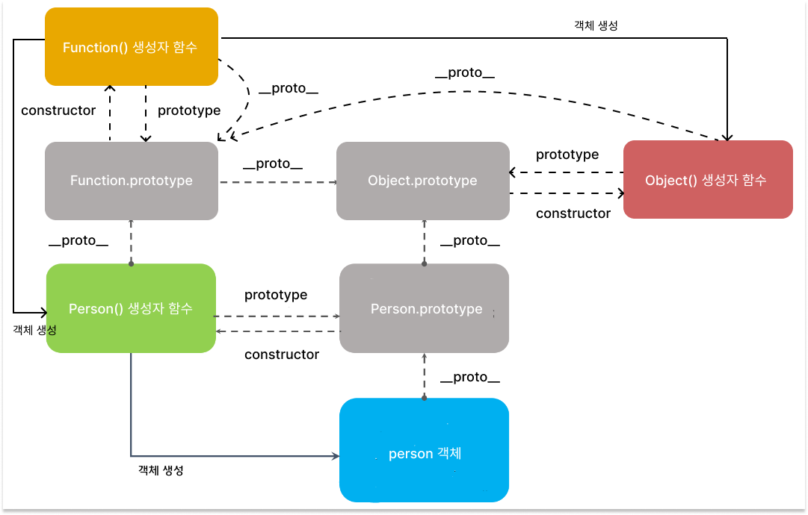
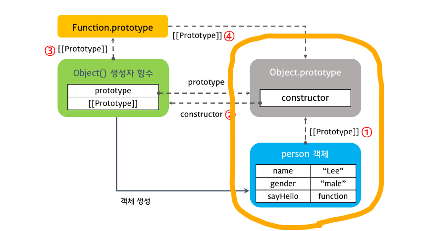
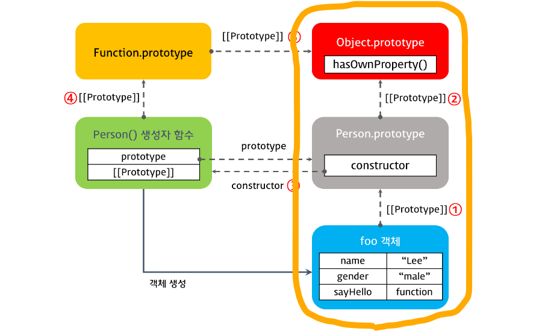

# 1. 개요

<figure>
    
    <figcaption>From debuggr.io/ By Sagiv Ben Giat..</figcaption>
</figure>

자바스크립트는 **프로토타입 기반의 객체 지향 언어**이다. ES6부터 클래스형 문법이 도입되었다고 하지만, 이는 "다른 객체 지향 언어처럼" 사용하도록 도와주는 API일 뿐이다. 실제 내부 동작은 여전히 프로토타입에 기반한다. 따라서 프로토타입을 빼고서는 자바스크립트의 객체 지향을 이해했다고 말할 수 없다.

# 2. 프로토타입

프로토타입이란 <b>생성자 함수가 참조하는 `prototype`</b> 혹은 <b>객체가 참조하는 `__proto__`</b>를 의미한다. 하나의 셍성자 함수와 해당 함수로 생성된 모든 객체들은 동일한 프로토타입 객체를 바라보고 있다. 다시 말해 동일한 프로토타입 객체가 생성자 함수 입장에서는 `prototype`이라 불리고, 생성된 객체의 입장에서는 `__proto__`라고 불린다.

보통은 프로토타입을 생성된 객체의 입장에서 이해하려고 한다. 그런데 그러면 함수의 `prototype` 속성이 헷갈리고 어렵게 느껴진다. 그보다는 함수 입장에서 이해를 시작하는 것이 더 바람직하다. 선후관계를 따지더라도 함수가 `prototype`을 속성을 가지기 때문에, 객체가 `__proto__` 속성을 가지게 된다.

## 2.2. prototype

- 함수 만이 가지고 있는 속성이다.
- 생성자 함수로 실행될 경우, 생성되는 객체가 `__proto__`로 참조할 프로토타입을 참조하고 있다.

`new` 키워드로 함수를 실행하면, 생성자 함수로 실행되어 객체를 생성한다. `new` 키워드가 익숙하지 않다면 ['자바스크립트 생성자 함수 & new 키워드' 포스팅](https://byongho96.github.io/TIL/posts/Language/JavaScript/new/)을 참고하길 바란다.

모든 함수는 `new` 키워드와 함께 객체를 생성할 수 있다. 따라서 자신이 생성한 객체가 참조해야할 프로토타입 객체를 미리 `prototype` 속성으로 가리키고 있다. 일반적으로 함수를 선언할 경우에는 자동으로 빈 객체를 가리킨다.

```js
function MyFunction() {}

console.log(MyFunction.prototype) // {}
```

## 2.2. \_\_proto\_\_

- 객체가 자신의 프로토타입 객체를 참조하는 속성이다.
- 내부적으로는 `Object.getPrototypeOf`가 메서드가 호출되어 Prototype 객체를 반환한다.

아래 `mike`객체는 `Person`함수에 의해 생성이 되었기 때문에 `Person.prototype`을 자신의 프로토타입으로 참조하고 있다.

```js
function Person(name, gender) {
  this.name = name
  this.gender = gender
  this.sayHelllo = function () {
    console.log('Hi')
  }
}

const mike = new Person('mike', 'male')
console.log(Person.prototype === mike.__proto__) // true
```

## 2.3. Object()

그렇다면 함수로 생성되지 않은 객체는 무엇을 프로토타입으로 가리켜야 할까? 그런데 이건 전제가 틀린 질문이다. 사실 **모든 객체는 생성자 함수로 만들어진다.** 우리가 객체 리터럴 `{}` 방식으로 객체를 선언하더라도, 자바스크립트가 내부적으로 `Object()` 함수를 실행해서 객체를 생성한다.

```js
const obj = {
  name: 'mike',
  sayHello: function () {
    console.log('Hello')
  },
}

// 위 방식으로 객체를 선언하더라도 자바스크립트는 아래처럼 객체를 생성한다.

const obj = new Object()
obj.name = 'mike'
obj.sayHello = function () {
  console.log('Hello')
}
```

따라서 객체 리터럴 방식으로 생성된 객체는 `Object.prototype`을 자신의 프로토타입으로 참조한다.

```js
let student = {
  name: 'Lee',
  score: 90,
}

console.log(student.__proto__ === Object.prototype) // true
```

## 2.4. constructor

`constructor`는 프로토타입 객체가 함수를 가리키는 속성 값이다. 이처럼 **프로토타입은 함수와 일대일로 대응된다.**

<figure>
    
    <figcaption>From 모던 자바스크립트 Deep Dive. By 이웅모.</figcaption>
</figure>

# 3. 함수 vs 객체

> 이 절의 내용은 이해할 필요가 없을 것 같다. 그냥 순수한 호기심에 작성해봤다.

자바스크립트에서 함수와 객체는 마치 닭과 달걀의 관계 같다. 서로가 서로로 인해 존재하기 때문에 선후 관계를 파악하기 매우 어렵다.

<figure>
    
    <figcaption>From 모던 자바스크립트 Deep Dive. By 이웅모.</figcaption>
</figure>

- **Function.prototype.\_\_proto\_\_ === Object.prototype**
  모든 함수는 일급 객체로써 객체를 상속받는다.

- **Object.\_\_proto\_\_ === Function.prototype**  
  `Object()` 또한 함수이기 때문에 `Function()`으로 생성된다.

# 4. 프로토타입 체이닝

프로토타입 체인이란 찾는 속성이나 메소드가 현재 객체에 없을 경우, 객체의 `__proto__`링크를 따라 프로토타입 객체를 거슬러가며 탐색한다. 이러한 탐색은 최종적으로 `Object.prototype`까지 이어진 후 종료된다.

- 자바스크립트의 모든 객체는 `Object.prototype`를 상속받는다.
- 최종적으로 `Object.prototype.__proto__`는 `null`을 참조하고 있다.

## 4.1. 객체 리터럴 방식의 생성

객체를 리터럴 방식으로 생성하면 다음과 같은 프로토타입 체인을 가진다. 객체 리터럴 방식으로 객체를 생성할지라도 내부적으로 `Object()`생성자 함수를 호출하기 때문에 최종적으로 `Object.prototype`까지 탐색한다.

<figure>
    
    <figcaption>From 모던 자바스크립트 Deep Dive. By 이웅모.</figcaption>
</figure>

## 4.2. 생성자 함수 방식의 생성

객체를 생성자 함수를 통해 생성하면 다음과 같은 프로토타입 체인을 가진다. 모든 객체는 `Object.prototype`을 상속받기 때문에 최종적으로 `Object.prototype`까지 탐색한다.

<figure>
    
    <figcaption>From 모던 자바스크립트 Deep Dive. By 이웅모.</figcaption>
</figure>

# 5. 프로토타입 활용

프로토타입은 객체 간에 **속성과 메소드를 공유**하는데 활용할 수 있다. 동일한 생성자 함수에 의해 생성된 객체들은 모두 동일한 프로토타입 객체를 바라본다. 따라서 프로토타입 객체에 추가된 속성과 메소드는 **프로토타입 체이닝 방식으로 공유**된다.

```js
function Person(name) {
  this.name = name
}

const mike = new Person('mike')
const james = new Person('james')

Person.prototype.sayHello = function () {
  console.log('Hello, I am ' + this.name)
}

mike.sayHello() // Hello, I am mike
james.sayHello() // Hello, I am james
```

헷갈리지 말아야할 것이 **생성자 함수 자체에 추가된 메소드는 공유되지 않는다.** 생성자 함수는 프르토타입 체이닝에 포함되지 않기 때문이다. 이처럼 생성자 함수 자체에 할당된 메소드를 ES6의 클래스 문법에서는 정적 메소드라 지칭하며 `static` 키워드로 구현된다.

```js
function Person(name) {
  this.name = name
}

const mike = new Person('mike')

Person.sayHello = function () {
  console.log('Hello, I am ' + this.name)
}

mike.sayHello() // TypeError: mike.sayHello is not a function
```

# 6. 참고자료

- [이웅모: 모던 자바스크립트 Deep Dive, 25장 클래스](https://poiemaweb.com/es6-class)
- [10분 테코톡: 아놀드의 프로토타입 뽀개기](https://www.youtube.com/watch?v=TqFwNFTa3c4)
