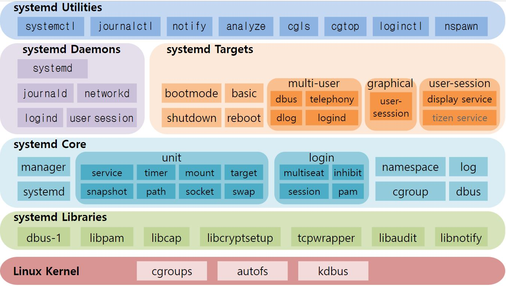
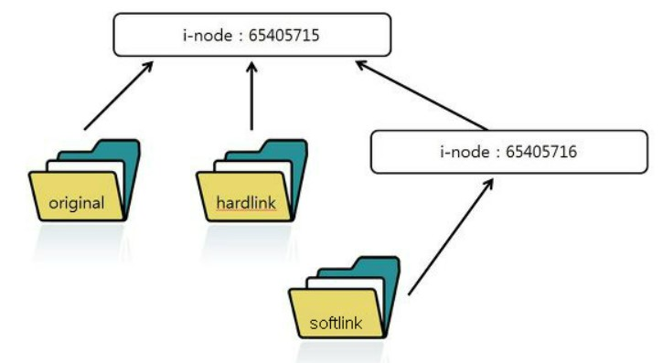

- [1. 기본](#1-기본)
  - [1.1. 명령어](#11-명령어)
    - [1.1.1. apt-get](#111-apt-get)
    - [1.1.2. cat](#112-cat)
    - [1.1.3. cd](#113-cd)
    - [1.1.4 cp](#114-cp)
    - [1.1.5 curl](#115-curl)
    - [1.1.6 echo](#116-echo)
    - [1.1.7 grep](#117-grep)
    - [1.1.8 find](#118-find)
    - [1.1.9 head](#119-head)
    - [1.1.10 history](#1110-history)
    - [1.1.11 ls](#1111-ls)
    - [1.1.12 mkdir](#1112-mkdir)
    - [1.1.13 mv](#1113-mv)
    - [1.1.14 pwd](#1114-pwd)
    - [1.1.15 rm](#1115-rm)
    - [1.1.16 tail](#1116-tail)
    - [1.1.17 tar](#1117-tar)
    - [1.1.18 touch](#1118-touch)
    - [1.1.19 which](#1119-which)
  - [1.2 환경 변수](#12-환경-변수)
    - [1.2.1. 쉘 환경변수](#121-쉘-환경변수)
    - [1.2.2. 전역 환경변수](#122-전역-환경변수)
    - [1.2.3. 쉘 설정파일](#123-쉘-설정파일)
    - [1.2.4. 예약 환경변수](#124-예약-환경변수)
  - [1.3. 리다이레션 및 다중명령어](#13-리다이레션-및-다중명령어)
    - [1.3.1. 스트림](#131-스트림)
    - [1.3.2. 리다이렉션](#132-리다이렉션)
    - [1.3.3. 파이프](#133-파이프)
  - [1.4. 쉘 스크립트](#14-쉘-스크립트)
    - [1.4.1. 변수](#141-변수)
    - [1.4.2. 문자열 비교 연산](#142-문자열-비교-연산)
    - [1.4.3. 산술 비교 연산](#143-산술-비교-연산)
    - [1.4.4. 논리 연산](#144-논리-연산)
    - [1.4.5. 파일 연산](#145-파일-연산)
    - [1.4.4. if 문](#144-if-문)
    - [1.4.5. case 문](#145-case-문)
    - [1.4.6. for 문](#146-for-문)
    - [1.4.7. while 문](#147-while-문)
- [2. 프로세스](#2-프로세스)
  - [2.1. 용어](#21-용어)
  - [2.2. 명령어(ps)](#22-명령어ps)
- [3. systemctl](#3-systemctl)
  - [3.1. systemd](#31-systemd)
  - [3.2. daemon](#32-daemon)
  - [3.2 .service](#32-service)
  - [3.3. 명령어](#33-명령어)
- [4. 사용자 및 권한](#4-사용자-및-권한)
  - [4.1. 사용자](#41-사용자)
    - [4.1.1. 유저 생성/수정/삭제](#411-유저-생성수정삭제)
    - [4.1.2. 그룹 생성/수정/삭제](#412-그룹-생성수정삭제)
  - [4.2. 권한](#42-권한)
    - [4.2.1. 파일 소유권 수정(chown)](#421-파일-소유권-수정chown)
    - [4.2.2. 파일 권한 수정(chmod)](#422-파일-권한-수정chmod)
- [5. 링크](#5-링크)
  - [5.1. 용어](#51-용어)
  - [5.2. 명령어(ln)](#52-명령어ln)

---

# 1. 기본

- **커널 (Kernel)**  
  커널은 운영체제의 핵심 부분으로, 시스템 자원을 관리하고, 프로세스 관리, 메모리 관리, 파일 시스템, 네트워크 등의 기능을 제공합니다.

* **쉘 (Shell)**  
  쉘은 사용자와 커널 사이에서 사용자의 명령어를 해석하고 실행하는 소프트웨어이다. 대표적인 쉘로는 bash, zsh, fish 등이 있다.

* **터미널 (Terminal)**
  터미널은 텍스트 기반 인터페이스를 제공하는 소프트웨어이다.터미널은 쉘을 실행하고, 쉘에서 실행한 명령어의 출력을 사용자에게 보여준다.

* **콘솔 (Console)**
  콘솔은 주로 하드웨어적인 의미로, 컴퓨터의 키보드와 모니터 등의 입출력 장치를 의미한다.

각각의 터미널에서 bash 쉘을 실행하면, 두 개의 bash 쉘이 서로 다르다. 즉, 각각의 쉘은 독립적으로 실행되며, 때문에 서로의 변수나 상태를 공유하지 않는다.

## 1.1. 명령어

### 1.1.1. apt-get

apt는 Linux 계열 시스템의 패키지 관리 툴이다.

```bash
# 설치된 패키지 업데이트
$ apt-get update

# 패키지 설치
$ apt-get install PACKAGE

# 패키지 업데이트
$ apt-get update PACKAGE

# 패키지 삭제, --purge 옵션으로 일부 남을 수 있는 구성까지 모두 삭제
$ apt-get --purge remove PACKAGE
```

### 1.1.2. cat

concatenate의 약자로 파일을 표준 출력으로 출력하는 명령어이다. 리다이렉션(>)이나 파이프(|)연산자와 결합하여 다양하게 사용된다.

```bash
# 파일 출력
$ cat FILE

# 내용 입력 후 (ctrl+D)눌러서 파일 생성
$ cat > FILE

# 라인마다 번호 출력
$ cat -n FILE

# 공백 라인 제외하고, 라인마다 번호 출력
$ cat -b FILE

# 반복된 공백 라인 하나로 처리해서 출력
$ cat -s FILE

# 파일 복사
$ cat FILE > COPY

# 파일 합치기
$ cat FILE1 FILE2 > FILE1_2

# 파일 추가
$ cat FILE2 >> FILE1

# 파일을 페이지 단위로 출력(엔터 입력 시 한 줄 더 출력, 스페이스바 입력 시 한 페이지 더 출력)
$ cat FILE | more

# 특정 문자열을 포함한 라인만 출력
$ cat FILE | grep "STR"

# 현재 디렉토리 모든 파일 출력
$ cat *

# 현재 디렉토리 특정 확장자의 모든 파일 출력
$ cat *.txt
```

### 1.1.3. cd

change directory의 약자로 현재 디렉토리에서 다른 작업 디렉토리로 이동할때 사용하는 명령어이다.

```bash
# 상위 디렉토리로 이동
$ cd ..

# 홈 디렉토리로 이동
$ cd ~

# 상대경로로 이동
$ cd foo/bar

# 절대경로로 이동
$ cd /home/foo/bar
```

### 1.1.4 cp

copy의 약자로 파일을 복사할 때 사용된다.

```bash
# 파일 -> 파일
$ cp FILE1 FILE2

# 파일 -> 디렉토리
$ cp FILE1 /home/foo/bar

# 여러 파일 -> 디렉토리
$ cp FILE1 FILE2 /home/foo/bar

# 디렉토리 -> 디렉토리
$ cp -r /home/foo /home/bar
```

### 1.1.5 curl

curl(client url)는 URL로 데이터를 보내거나 가져올때 사용한다. 간단히 말한 커맨드라인에서 REST API 테스트할 수 있다.

```bash
# -X: 요청 메소드를 설정. default값은 GET이다.
curl  www.example.com
curl -X GET www.example.com
curl -X PUT -d 'name=mkyong&email=abc@gmail.com' http://localhost:8080/user/100

# -H: 헤더 옵션 설정
$ curl -d "key1=value1&key2=value2" \
-H "Content-Type: application/x-www-form-urlencoded" \
-X POST http://localhost:8000/data

# -d: body 데이터 설정
# # url 형식 데이터
$ curl -d "key1=value1&key2=value2" \
-H "Content-Type: application/x-www-form-urlencoded" \
-X POST http://localhost:8000/data
# # json 형식 데이터
$ curl -d '{"key1":"value1", "key2":"value2"}' \
-H "Content-Type: application/json" \
-X POST http://localhost:8000/data

# -L: 301, 302 응답을 받을 경우 리다이렉션을 따름

# -o / -O: 응답을 저장할 파일의 이름을 설정
# # 직접 파일 이름을 지정(python.tar.bz2)
$ curl -o python.tar.bz2 https://downloads.python.org/pypy/pypy3.7-v7.3.4-linux64.tar.bz2
# # 미리 정의된 파일 이름을 그대로 사용(pypy3.7-v7.3.4-linux64.tar.bz2)
$ curl -O https://downloads.python.org/pypy/pypy3.7-v7.3.4-linux64.tar.bz2
```

### 1.1.6 echo

문자열 혹은 변수를 표준 출력으로 출력한다.

```bash
# 문자열 출력
$ echo print this message
$ echo "print this message"

# -e: 문자열에서 이스케이프 문자를 인식
$ echo -e "print \n this message"

# 파일로 리이렉트
$ echo "save this message" > FILE
$ echo "add this message" >> FILE

# 변수 출력
$ A=123
$ echo $A
$ echo "The Result is $A"

# 명령어 결과를 출력
$ echo "Current directory is $(pwd)"
$ echo "1 + 2  == $((1 + 2))"
```

### 1.1.7 grep

입력으로 전달된 파일, 혹은 표준 입력에서 특정 문자열 패턴(정규식)을 찾는다.

```bash
# 파일에서 특정 문자열 검색
$ grep "STR" FILE

# 현재 디렉토리 모든 파일에서 특정 문자열 검색
$ grep "STR" *

# -i: 대소문자 구분하지 않고 문자열 검색
$ grep -i "STR" FILE

# -v: 매칭되는 문자열이 없는 라인 검색
$ grep -v "STR" FILE

# 현재 디렉토리 및 하위 모든 디렉토리의 파일 검색
$ grep -r "STR" *

# 문자열 출력시 파일 이름도 함께 출력
$ grep -H "STR" *

# 문자열 출력시 라인 번호도 함께 출력
$ grep -n "STR" *

# 찾으려는 패턴 문자열을 정규식이 아닌 일반 문자열로 인식
$ grep -F "STR" FILE
```

### 1.1.8 find

리눅스 파일 시스템에서 파일을 검색하는 데 사용되는 명령어이다.

```bash
# 현재 디렉토리에서 test가 포함되는 파일 찾기
$ find -name "*test*"

# 모든 디렉토리에서 test가 포함되는 파일 찾기
$ find / -name "*test*"

# 현재 및 하위 디렉토리에서 test가 포함되는 파일 찾기
$ find . -name "*test*"

# 현재 디렉토리에서 .txt 확장자 모두 찾기
$ find  -name "*.txt"

# 현재 디렉토리에서 test로 시작되는 파일 찾기
$ find -name "test*"

# 현재 디렉토리에서 test로 끝나는 파일 찾기
$ find -name "*test"

# 현재 디렉토리에서 모든 디렉토리 찾기
$ find -type d

# 현재 디렉토리에서 test가 들어가는 디렉토리 찾기
$ find -name "*test*" -type d

# 현재 디렉토리에서 모든 파일 찾기
$ find -type f
```

### 1.1.9 head

파일의 상단 일부를 출력하기 위한 명령어이다.

```bash
# 파일의 상단 10줄 출력
$ head FILE

# 파일의 상단 100줄 출력
$ head -num 100 FILE
```

### 1.1.10 history

사용한 커맨드 내역을 출력하기 위한 명령어이다.

```bash
# 사용한 명령어를 모두 출력(최대 500개)
$ history

# 사용한 명령어 중 최근 몇개를 출력
$ history 7

# 특졍 커맨드가 포함된 명령어를 출력
$ history | grep CMD
```

### 1.1.11 ls

지정된 디렉토리의 파일 및 디렉토리 목록을 출력한다

```bash
# 파일을 알파벳 순으로 출력
$ ls

# -a: 숨겨진 파일이나 디렉토리도 출력
$ ls -a

# -l: 권한, 포함 파일 수, 소유자, 그룹, 파일크기, 수정일자 등 자세한 내용을 출력
$ ls -l

# -s: 파일을 크기 순으로 출력
$ ls -s

# -r: 파일을 역순으로 출력
$ ls -r

# -R: 하위 디렉토리까지 출력
$ ls -R

# -h: 파일 크기를 사람(human)이 보기 좋게 표시하여 출력
$ ls -u
```

### 1.1.12 mkdir

새로운 디렉토리를 생성하고 싶을 때 사용한다.

```bash
# 현재 경로에 디렉토리 생성
$ mkdir DIR

# 절대 경로에 디렉토리 생성
$ mkdir /home/foo/bar/DIR

# 현재 경로에 여러 개의 디렉토리 생성
$ mkdir DIR1 DIR2 DIR3

# 상위 디렉토리를 포함하여 새로 생성 (home, foo, bar 디렉토리도 없을 경우 생성)
$ mkdir -p /home/foo/bar/DIR
```

### 1.1.13 mv

move의 약자로 파일을 이동할 때 사용된다.

```bash
# 파일 이동(이름변경)
$ mv FILE1 FILE2

# 파일 -> 디렉토리로 이동
$ mv FILE1 DIR/

# 여러 파일 -> 디렉토리로 이동
$ mv FILE1 FILE2 DIR/

# 디렉토리 이동(이름변경)
$ mv DIR1/ DIR2/
```

### 1.1.14 pwd

Print Working Directory의 약자로 현재 작업경로를 절대경로로 출력한다

```bash
# 현재 위치 절대경로로 출력
$ pwd
```

### 1.1.15 rm

파일이나 디렉토리를 살제하는 명령어이다.

```bash
# 파일 삭제
$ rm FILE

# 디렉토리 삭제
$ rm -r DIR

# 파일/디렉토리 삭제 시 확인메시지 출력하지 않음
$ rm -rf DIR
```

### 1.1.16 tail

파일의 하단 일부를 출력하기 위한 명령어이다.

```bash
# 파일의 하단 10줄 출력
$ tail FILE

# 파일의 허단 100줄 출력
$ tail -num 100 FILE
```

### 1.1.17 tar

여러 파일을 하나의 파일(.tar)로 묶을 수 있고, 이어서 gzip 또는 bzip2 형태로 압축할 수 있다. tar형태의 파일은 묶여지기 전 파일들의 속성과 심볼릭 링크, 디렉토리 구조 등을 그대로 가져갈 수 있다.

```bash
-f     : 대상 tar 아카이브 지정. (기본 옵션)
-c     : tar 아카이브 생성. (파일 묶을 때 사용)
-x     : tar 아카이브에서 파일 추출. (파일 풀 때 사용)
-v     : 처리되는 과정(파일 정보)을 나열.
-z     : gzip 압축 적용 옵션.
-j     : bzip2 압축 적용 옵션.
-t     : tar 아카이브에 포함된 내용 확인.
-C     : 대상 디렉토리 경로 지정.

# 현재 디렉토리의 모든 파일과 디렉토리를 tar로 묶기
$ tar cvf T.tar *

# 대상 디렉토리를 포함한 모든 파일과 디렉토리를 tar로 묶기
$ tar cvf T.tar [PATH]

# 파일을 지정하여 tar로 묶기
$ tar cvf T.tar [FILE_1] [FILE_2]

# tar 아카이브를 현재 디렉토리에 풀기
$ tar xvf T.tar

# tar 아카이브를 지정된 디렉토리에 풀기
$ tar xvf T.tar -C [PATH]

# tar 아카이브의 내용 확인
$ tar tvf T.tar

# 현재 디렉토리를 tar로 묶고 gzip으로 압축하기
$ tar zcvf T.tar.gz *

# gzip으로 압축된 tar 아카이브를 현재 디렉토리에 풀기
$ tar zxvf T.tar.gz

# 현재 디렉토리를 tar로 묶고 bzip2로 압축하기
$ tar jcvf T.tar.bz2 *

# bzip2로 압축된 tar 아카이브를 현재 디렉토리에 풀기
$ tar jxvf T.tar.bz2
```

### 1.1.18 touch

파일을 생성할 때 사용하는 명령어

```bash
# 현재 디렉토리에 파일 생성
$ touch FILE
```

### 1.1.19 which

명령어의 위치를 찾을 때 사용하는 명령어

```bash
# 특정 커맨드의 위치를 검색
$ which CMD
```

## 1.2 환경 변수

리눅스에서 시스템 또는 사용자의 환경에 영향을 미치는 변수. 쉘에 의해 관리되며, 터미널에서 사용되는 명령어에서 참조될 수 있다.

### 1.2.1. 쉘 환경변수

export 없이 선언된 변수로써, 현재 쉘 세션에서만 유효하다. 하위 쉘에서는 유효하지 않다.

```bash
$ A=abc
$ echo $A
```

### 1.2.2. 전역 환경변수

export와 함께 선언된 변수로써, 현재 쉘과 하위 쉘에서 유효한다. 하지만 여전히 다른 쉘에서는 사용할 수 없다.

```bash
$ export A=abc
$ echo $A
```

### 1.2.3. 쉘 설정파일

쉘이 실행될때마다 자동으로 실행되는 스크립트 파일로써, 쉘에서 사용하는 변수나 함수를 설정하는데 쓰인다.

쉘 설정파일의 실행순서는 아래와 같다.
`/etc/profile` → `/etc/bashrc` → `~/.bash_profile` → `~/.bashrc` → `~/.bash_logout`

- **/etc/profile**  
  로그인 시 시스템 전체 환경(모든 사용자)에 적용되는 환경설정 파일이다. 전역변수를 선언할 때 사용되지만, 꼭 필요한 상황에서만 사용하는 것을 권장한다.
- **/etc/bashrc**  
  시스템 전체 환경(모든 사용자)에 적용되는 환경설정 파일이다. 전역으로 사용하게 될 함수나 별칭을 추가하여 사용하는 것을 권장한다. 비로그인 쉘에서도 적용된다.
- **~/.bash_profile**  
  사용자 별로 적용되는 설정 파일로, 해당 사용자에게만 적용되는 변수를 설정한다. /etc/profile보다 나중에 적용되어 전역변수를 덮어쓸 수 있다.
- **~/.bashrc**  
  사용자 별로 적용되는 설정 파일로, 해당 사용자에게만 적용되는 함수나 별칭을 추가하여 사용하는 것을 권장한다. /etc/bashrc보다 나중에 적용되어 전역함수를 덮어쓸 수 있다.

### 1.2.4. 예약 환경변수

쉘 프로그램이 시작될 때 자동으로 설정되는 환경 변수이다.일반적으로 쉘 설정 파일(예: ~/.bashrc, ~/.bash_profile)에서 설정되지 않으며 쉘 프로세스의 메모리 공간에 있는 환경변수 테이블에서 관리된다.

```bash
# 전체 환경변수 확인 명령어
$ env

BASH        사용하는 bash 쉘 경로
COLUMNS     터미널 컬럼 수
DISPLAY     X 디스플레이 이름
EDITOR      기본 편집기
HISTFILE    history 파일 경로
HISTSIZE    history에 저장되는 개수
HOME        사용자 홈 디렉토리
HOSTNAME    호스트 이름
LANG        기본 언어
LINES       터미널 라인 수
LOGNAMES    로그인 이름
MAIL        메일을 보관하는 경로
MANPATH     man 페이지 경로
OSTYPE      운영체제 타입
PATH        실행 파일 경로
PS1         명령 프롬프트변수
PWD         현재 작업 디렉토리
SHELL       로긴 쉘
TERM        터미널 타입
UID         사용자 UID
USER        사용자 이름
VISUAL      Visual 편집기
```

## 1.3. 리다이레션 및 다중명령어

### 1.3.1. 스트림

리눅스의 표준입력 스트림, 표준 출력 스트림, 표준 오류 스트림은 기본적으로 다음의 파일 디스크립터를 할당받는다. 파일 디스크립터(fd)는 프로세스가 파일에 접근하기 위해 제공되는 고유 식별자이다.

| 종류             | 영문  | 파일 디스크립터 |
| ---------------- | ----- | --------------- |
| 표준 입력 스트림 | stdin | 0               |
| 표준 출력 스트림 | stdin | 1               |
| 표준 오류 스트림 | stdin | 2               |

표준 출력(덮어쓰기) > 명령어 > 파일 명령어의 표준 출력 스트림의 도착 지점을 파일로 설정(덮어쓰기)
표준 출력(추가) » 명령어 » 파일 명령어의 표준 출력 스트림의 도착지점 파일에 내용 추가
표준 입력 < 명령어 < 파일 파일로부터 입력 받음

### 1.3.2. 리다이렉션

| 종류               | 기호 | 사용법         | 설명                                                |
| ------------------ | ---- | -------------- | --------------------------------------------------- |
| 표준 출력 덮어쓰기 | >    | 명령어 > 파일  | 명령어의 표준 출력 스트림의 도착 지점을 파일로 설정 |
| 표준 출력 추가하기 | >>   | 명령어 >> 파일 | 명령어의 표준 출력 스트림의 도착 지점을 파일에 추가 |
| 표준 입력 받아오기 | <    | 명령어 < 파일  | 파일로부터 표준 입력을 입력받음                     |

```bash
# ls 명령어의 결과를 출력하지 않고, ls_list.txt로 저장함
$ ls > ls_list.txt

# ls 명령어의 결과를 출력하지 않고, ls_list.txt에 이어 씀
$ ls >> ls_list.txt

# 표준 입력(키보드)이 아니라 파일로부터 표준 입력을 받는다
$ tail -n 2 < ls_list.txt

# 2>&1: 오류 출력(2)를 표준 출력(1)으로 받는다. 1앞의 &은 1이 파일 디스크립터임을 알려준다.
$ 2>&1

# /dev/null: dev/null로 리다이렉트 시킨다는 말은, 데이터가 없애고 출력하지 않는다는 의미이다.
$ /script.sh > /dev/null 2>&1 # 출력과 에러 모두 보지 않겠다
```

### 1.3.3. 파이프

이전 프로세스의 표준 출력을 다음 프로세스의 표준 입력으로 받는다.

```bash
# 예시) 현재 디렉토리에서 최근 10개 파일을 표시
$ ls -lt | head
```

## 1.4. 쉘 스크립트

리눅스 명령어들을 하나의 스크립트 파일에 묶어 선언한 것으로써, 명령어를 기능 단위로 실행할 수 있다.

쉘 스크립트 파일은 첫번째 행에 어떤 쉘로 스크립트를 실행할지 정의해야 한다. 유닉스 쉘에는 여러 종류가 있지만, 현재 대부분 bash쉘을 사용한다.

쉘에서 선언된 변수는 기본적으로 전역 변수(global variable)다

```sh
#!/usr/bin/bash

...코드
```

### 1.4.1. 변수

쉘 커맨드 및 스크립트에서 변수는 기본적으로 **문자열**로 할당된다

- **arguments**  
  쉘스크립트 실행시 전될되는 인자들이 변수로 할당된다.
  ```bash
  $0	쉘 스크립트명
  $1	첫번째 arguemnt
  $2	두번째 argument
  $3...
  $#	argument 갯수
  $$	쉘 스크립트의 PID
  ```
- **$()**
  쉘 커맨드의 실행 결과를 문자열로 반환한다.
- **${}**
  선언된 변수를 사용한다. $ 만으로도 변수를 읽어오지만 다른 문자열들이 앞뒤로 사용될 때 정확한 변수명을 지정하기 위해 {}가 같이 사용된다.

### 1.4.2. 문자열 비교 연산

| 산술 비교 연산자 | 설명                                      |
| ---------------- | ----------------------------------------- |
| var1 = var2      | var1과 var2가 같은 경우 true를 반환함     |
| var1 == var2     | var1과 var2가 같은 경우 true를 반환함     |
| var1 != var2     | var1과 var2가 다른 경우 true를 반환함     |
| -z var1          | var1의 길이가 0인 경우 true를 반환함      |
| -n var1          | var1의 길이가 0이 아닌 경우 true를 반환함 |

- **이중 대괄호**  
  &&, ||, = ~ \* (정규식 매칭) 과 같은 확장 expression test 기능을 대괄호 내에 사용할 수 있다.

  ```sh
  if [[ $a == z* ]]    # $a 가 "z"로 시작할 경우 (패턴매칭)
  if [[ $a == "z*" ]]  # $a 가 z* 와 같을 경우

  if [ "$a" == "z*" ]  # $a 가 z* 와 같다면 참
  if [ $a == z* ]      # 파일 globbing이나 낱말 조각남이 일어남
  ```

### 1.4.3. 산술 비교 연산

| 산술 비교 연산자 | 설명                                    |
| ---------------- | --------------------------------------- |
| var1 -eq var2    | var1과 var2가 같은 경우 true를 반환함   |
| var1 -ne var2    | var1과 var2가 다른 경우 true를 반환함   |
| var1 -gt var2    | var1가 var2보다 큰 경우 true를 반환함   |
| var1 -lt var2    | var1가 var2보다 작은 경우 true를 반환함 |
| var1 -ge var2    | var1가 var2 이상인 경우 true를 반환함   |
| var1 -le var2    | var1가 var2 이하인 경우 true를 반환함   |
| ((var1 > var2))  | var1가 var2보다 큰 경우 true를 반환함   |
| ((var1 < var2))  | var1가 var2보다 작은 경우 true를 반환함 |
| ((var1 >= var2)) | var1가 var2 이상인 경우 true를 반환함   |
| ((var1 <= var2)) | var1가 var2 이하인 경우 true를 반환함   |

- **이중 괄호**
  expression 에는 수식이나 비교 표현식이 들어갈 수 있다.

  ```sh
  if (( ${num1} < ${num2} ))
  ```

### 1.4.4. 논리 연산

| 논리 연산자 | 설명     | 예시                                                                   |
| ----------- | -------- | ---------------------------------------------------------------------- |
| -a          | 논리 and | if [ $a -eq 0 -a $b -eq 1 ]                                            |
| -o          | 논리 or  | if [ $a -eq 0 -o $b -eq 1 ]                                            |
| &&          | 논리 and | if [ $a -eq 0 ] && [ $b -eq 1 ] <br /> if [[$a -eq 0 && $b -eq 1]]     |
| \|\|        | 논리 or  | if [ $a -eq 0 ] \|\| [ $b -eq 1 ] <br /> if [[$a -eq 0 \|\| $b -eq 1]] |

### 1.4.5. 파일 연산

| 파일 연산자 | 의미          | 표현                   |
| ----------- | ------------- | ---------------------- |
| -d          | is directory  | if [ -d FILE ]         |
| -f          | is file       | if [ -f FILE ]         |
| -e          | does exist    | if [ -e FILE ]         |
| -r          | is readable   | if [ -r FILE ]         |
| -w          | is writable   | if [ -w FILE ]         |
| -x          | is executable | if [ -x FILE ]         |
| -nt         | is newer than | if [ FILE1 -nt FILE2 ] |
| -ot         | is older than | if [ FILE1 -ot FILE2 ] |

### 1.4.4. if 문

```sh
if [ 조건식 ]; then
    명령어
elif [ 조건식 ]; then
    명령어
else
    명령어
fi
```

### 1.4.5. case 문

```sh
COUNTRY=korea

case $COUNTRY in
  "korea"|"japan"|"china") # or 연산도 가능하다
    echo "$COUNTRY is Asia"
    ;;
  "USA"|"Canada"|"Mexico")
    echo "$COUNTRY is Ameria"
    ;;
  * )
    echo "I don't know where is $COUNTRY"
    ;;
esac
```

### 1.4.6. for 문

```sh
for ((i=1; i<=4; i++)); do
    echo $i
done

for x in 1 2 3 4 5
do
    echo "${x}"
done
```

### 1.4.7. while 문

```sh
count=0
while [ ${count} -le 5 ];
do
    echo ${count}
    count=$(( ${count}+1 ))
done
```

# 2. 프로세스

## 2.1. 용어

- **UID**  
  User ID. 사용자 ID
- **PID**  
  Process ID. 운영체제에서 프로세스를 식별하기 위한 ID
- **PPID**  
  Parent Process ID. 부모 프로세스의 PID
- **PGID**  
  Process Group ID. 1개 이상의 프로세스의 그룹을 식별하기 위한 ID
- **SID**  
  Session ID. 1개 이상의 프로세스의 그룹의 묶음을 식별하기 위한 ID

## 2.2. 명령어(ps)

ps 명령어 입력 시 나오는 테이블의 항목에 대한 세부내용은 다음과 같다

| 칼럼  | 설명                                   |
| ----- | -------------------------------------- |
| C     | CPU 사용량(%)                          |
| TTY   | 프로세스를 시작한 터미널               |
| RSS   | 메모리 사용량                          |
| TIME  | 프로세스 총 가동시간                   |
| STIME | 프로세스 시작시간                      |
| CMD   | 해당 프로세스를 시작하는데 쓰인 명령어 |

| 명령어                                          | 설명                                                               |
| ----------------------------------------------- | ------------------------------------------------------------------ |
| ps                                              | 현재 사용자가 실행 중인 프로세스                                   |
| ps -e                                           | 모든 사용자가 실행 중인 프로세스                                   |
| ps -f                                           | 프로세스 상세정보 출력                                             |
| ps -p [PID]                                     | 특정 프로세스 정보 출력                                            |
| ps -u [UID]                                     | 특정 사용자가 실행 중인 프로세스 정보 출력                         |
| ps -H                                           | 인덴트로 부모 자식 관계 시각화                                     |
| ps -ef \| grep [keyword1] \| grep -v [keyword2] | CMD에 keyword1을 포함하고 keyword2를 포함하지 않은 프로세스 필터링 |

# 3. systemctl

## 3.1. systemd

systemd는 Linux 운영체제의 시스템 서비스(데몬)를 동작 원리와 관계없이 일관된 인터페이스를 제공한다. 여러 개의 서비스를 병렬적으로 수행할 수 있기 때문에 확장성에 용이하고, 사용자에 따라 프로세스를 구분하여 관리할 수 있다. 또한 서비스 간 의존성 추적, 로그 기록 관리 등의 기능을 통해 트러블 슈팅을 쉽게 해결할 수 있다.



<!-- ### 2.1.1. systemd components

systemd는 여러 컴포넌트로 이루어져 있으며, 다음과 같은 구조를 가지고 있다.


- **systemd init system**
  서비스 및 프로세스 관리를 담당합니다. 기존의 SysV init 시스템을 대체하고 시스템 서비스를 보다 현대적이고 유연하게 관리할 수 있는 방법을 제공합니다. 선언적 구성 형식을 사용하여 서비스, 대상 및 기타 시스템 구성 요소를 정의합니다.
- **systemd service manager**
  서비스 관리자는 시스템 서비스를 시작, 중지 및 관리할 책임이 있습니다. 서비스를 관리하기 위한 표준 인터페이스를 제공하고 소켓 활성화, 프로세스 추적 및 서비스 종속성과 같은 고급 기능을 지원합니다.
- **systemd journal**
  저널은 시스템 로그 및 기타 진단 정보를 저장하는 중앙 로그 저장소입니다. 이진 형식을 사용하여 로그를 저장하고 구조화된 로깅, 로그 순환 및 로그 필터링과 같은 고급 기능을 제공합니다.제공합니다. 선언적 구성 형식을 사용하여 서비스, 대상 및 기타 시스템 구성 요소를 정의합니다.
- **systemd units**
  단위는 systemd의 구성 요소이며 서비스, 장치 및 소켓과 같은 시스템 리소스를 나타냅니다. 각 장치에는 속성 및 종속성을 정의하는 고유한 이름과 구성 파일이 있습니다.
- **systemd targets**
  대상은 다중 사용자 또는 그래픽 사용자 인터페이스(GUI) 모드와 같이 시스템의 작동 모드를 정의하는 미리 정의된 상태입니다. 이들은 단위를 함께 그룹화하고 시작 또는 중지할 순서를 정의합니다.
- **systemd libraries**
  Systemd는 systemd 인프라와 통합하는 데 사용할 수 있는 라이브러리 세트를 제공합니다. 이러한 라이브러리는 서비스 시작 및 중지, 네트워크 소켓 관리 및 기타 시스템 관련 작업을 위한 표준화된 인터페이스를 제공합니다.

### 2.1.2. systemd directories

/etc/systemd/system/: This directory contains system-wide unit files and configuration files that define system services and other resources. These files are typically customized by the system administrator to configure system behavior.

/run/systemd/system/: This directory contains runtime unit files and other resources that are created and managed by systemd at runtime. These files are typically created when the system boots up and are removed when the system shuts down.

/usr/lib/systemd/: This directory contains system libraries and other resources that are used by systemd and its components.

/usr/share/systemd/: This directory contains documentation files and other resources that provide information about systemd and its components.

/var/lib/systemd/: This directory contains state files and other resources that are used by systemd to track system state and configuration changes. -->

## 3.2. daemon

데몬이란 시스템 서비스라고도 불리며, 사용자와의 상화작용 없이 컴퓨터 백그라운드에서 돌아가는 프로글메을 말한다. 보통 시스템(컴퓨터)가 켜짐과 동시에 자동으로 시작된다. 리눅스 운영체제에서 데몬은 systemd에 의해서 관리된다.

데몬은 사용자 레벨에서 접근할 수 없는 기능들을 동작시키는데 유용하다. 예를 들어 웹 서버, 데이터 서버 등의 다른 프로그램을 동작시키거나 하드웨어 디바이스와 상호작용할 때 쓰인다.

## 3.2 .service

.service 파일은 unit 설정 파일이라고 불리며, 리눅스 운영체제에서 systemd가 관리할 시스템 서비스를 정의한다. `/etc/systemd/system` 디렉토리에 .service 파일을 위치시키면 systemd가 해당 서비스를 설정파일에 따라 관리하기 시작한다.

기본적으로 systemd 서비스의 이름은 /etc/systemd/system 디렉토리에 있는 장치 파일명으로 결정된다. (서비스 이름은 `systemctl`커맨드 사용 시, .service 확장파일을 확장자명 없이 지칭할 수 있는 별칭을 의미한다.) 필요에 따라서 [INSTALL] 섹션에 Aias 옵션을 통해 서비스 이름을 설정파일과 다르게 설정할 수 있다.

하나의 서비스는 하나 이상의 프로세스를 생성하며, 그 중 메인 프로세스가 해당 서비스와 직접적인 연결관계를 가진다.

```c
[UNIT]
Description
// 서비스 설명으로, 서비스의 로그에 기록된다.

After
// 본 서비스 이전에 실행해야 할 서비스

Before
// 본 서비스 이후에 실행해야 할 서비스

Requires
// 본 서비스와 반드시 함께 실행해야 할 서비스

Wants
// 본 서비스와 함께 실행할 서비스 (실행되지 않더라도 본서비스는 실행됨)

[SERVICE]
Type
// 서비스의 시작 유형을 지정한다. [simple | forking | oneshot | dbus | notify | idle]
// simple : deafult값. systemd가 서비스에 대해 장기간 실행을 기대하는 메인 프로세스를 생성한다. -> 프로세스 종료 시 실패로 간주한다.
// forking : systemd가 생성한 메인 프로세스는 자식 프로세스를 fork하고, 메인 프로세스 자격을 넘겨 준뒤 종료된다. 자식 프로세스의 PID를 PIDFlie옵션에 정의된 경로에 저장한다.
// oneshot : systemd가 서비스에 대해 단기간 실행을 기대하는 메인 프로세스를 생성한다. -> 프로세스 완료 시 성공으로 간주하고, 장기간 구동 시 실패로 간주한다.
// dbus : D-Bus 서비스(프로세스간 통신)임을 명시한다.
// notify : 프로세스가 요청을 수락할 준비가 되었을 때, systemd에 알람을 보낸다. -> 데이터베이스 서버와 같이 시작하는데 시간이 걸리는 서비스에 유용하다.

Environment
//서비스에 사용할 환경 변수를 선언한다.
EnvironmentFile
//서비스의 환경설정을 파일을 지정한다.

ExecStartPre
ExecStart
ExecStartPost
ExecStop
ExecStopPost
// 각각의 상황에 맞는 명령어 혹은 명령어를 지정한다.
// Ex 1.
// ExecStart=/usr/bin/python3 /path/to/script.py
// Ex 2.
// ExecStart=/bin/bash /path/to/script.sh
// Ex 3.
// ExecStart=/bin/bash /path/to/script.sh arg1 arg2

KillMode
// 프로세스가 어떻게 중지 되는지 결정 [control-group|process|none]
// control-group : 해당 서비스가 포함된 그룹의 모든 서비스를 중지 시킨다.
// process : 해당 서비스의 메인 프로세스만 중지 시킨다.
// none : defualt값. 아무런 행동도 하지 않는다.

PIDFile
// 서비스가 자신의 pid를 기록한다. (Type=forking 옵션과 함께 자주 사용된다.)
// PIDFILE = /var/run/myservice.pid

Restart
// 서비스 종료 시, 재시작 설정	[no | on-success | on-failure | on-watchdog | on-abort | always ]
// no: defualt 값.
// on-success: 프로세스가 성공적으로 종료(status가 0) 시 재시작
// on-failure: 프로세스가 실패(status가 0이 아님) 시 재시작
// always: 무조건 재시작

RestartSec
// 서비스 재시작까지 대기하는 시간. 기본값 100ms

User
// 해당 서비스를 실행할 주체를 설정. (서비스 실행과 관련된 권한을 가지고 있어야 한다.)
// default 값 root. 보안상의 이유로 추천하지 않는다.

Group
// User가 포함된 그룹을 지정.
// default 값 primary group of the user.

[INSTALL]
WantedBy
// Wants의 반대 관계를 명시한다.

Also
// 함께 enable, disable할 serivce들을 지정.

Alias
// service의 별칭 설정.
```

## 3.3. 명령어

| 명령어                              | 설명                         |
| ----------------------------------- | ---------------------------- |
| systemctl daemon-reload             | systemd 서비스 업데이트      |
| systemctl start [SERVICE]           | 서비스 시작                  |
| systemctl stop [SERVICE]            | 서비스 중지                  |
| systemctl restart [SERVICE]         | 서비스 재시작                |
| systemctl enable [SERVICE]          | 부팅 시 서비스 자동시작      |
| systemctl disable [SERVICE]         | 부팅 시 서비스 자동시작 해제 |
| systemctl list-units --type=service | 서비스 목록 확인             |
| journalctl -u [SERVICE]             | 서비스 로그 기록 확인        |

# 4. 사용자 및 권한

## 4.1. 사용자

리눅스는 다중 사용자 운영체제로, 하나 이상의 사용자 계정을 생성하고 동시접속할 수 있다. root 권한이 있는 유저만 사용자를 관리할 수 있다.

또한 모든 사용자는 하나 이상의 그룹에 속해있고, 계정 생성 시 따로 지정하지 않을 경우 users 그룹에 자동으로 할당된다. 각각의 그룹은 식별가능한 고유의 그룹아이디(gid)를 가진다.

### 4.1.1. 유저 생성/수정/삭제

```bash
# 사용자 목록 확인
$ cat /etc/passwd

# 유저 정보 조회
$ id USER

# 유저 생성
$ useradd USER

# 유저 패스워드 생성 및 변경
$ passwd USER

# 유저 정보 수정
$ userpmod [options] [value] USER

# 유저와 관련 파일 모두 삭제
$ userdel -rf USER
```

### 4.1.2. 그룹 생성/수정/삭제

```bash
# 그룹 목록 확인
$ cat /etc/group

# 그룹 정보 조회
$ groups GROUP

# 그룹 생성. -g 옵션으로 지정하지 않을 경우, gid는 1000번부터 순차적으로 생성됨
$ groupadd -g 1020 GROUP

# 그룹 정보 수정
$ groupmod [options] [value] GROUP

# 그룹 강제 삭제
$ groupdel -f GROUP

# 그룹 암호 설정
$ gpasswd GROUP

# 그룹 암호 제거
$ gpasswd -r GROUP

# 그룹 사용자 추가
$ gpasswd -a USER GROUP

# 그룹 사용자 제거
$ gpasswd -d USER GROUP

```

## 4.2. 권한

각각의 파일/디렉토리는 소유 유저 / 소유 그룹 / 모든 유저 에 대한 읽기(r), 쓰기(w), 실행(x) 권한을 분리해서 관리한다. 소유 사용자는 파일을 생성한 유저, 소유 그룹은 파일을 생성한 유저의 기본그룹으로 기본 할당된다.
이에 대한 정보는 ls 명령어 실행 시 -l 옵션을 넣어 확인할 수 있다.

```bash
$ ls -l

-rw-r--r-- 1 ppotta manager 17 Mar 24 03:17 FILE
# 첫번째 '-' 를 제외하고 차례대로 소유 유저 / 소유 그룹/ 모든 사용자에 대한 권한을 rwx순으로 나열한다.
# 소유 유저는 읽기(r), 쓰기(w) 권한을 가진다.
# 소유 그룹은 읽기(r) 권한을 가진다.
# 모든 사용자는 읽기(r) 권한을 가진다.
```

또한 디렉토리에 대한 rwx 권한의 의미는 각각 다음과 같다.

- r: 디렉토리에 있는 파일 및 디렉토리 리스트 읽기
- w: 디렉토리에 파일 추가, 이름 변경, 삭제
- x: 디렉토리에 접근. cd 명령으로 working directory 이동

### 4.2.1. 파일 소유권 수정(chown)

chown 명령어는 해당 파일의 소유자 및 root권한이 있는 사용자만 실행할 수 있다.

```sh
# 파일의 소유 유저 변환
chown USER FILE

# 파일의 소유 그룹 변환
chown .GROUP FILE

# 파일의 소유 유저와 그룹 변환
chown USER.GROUP FILE

# 디렉토리와 하위 파일의 소유권 변환
chown -R USER.GROUP DIR
```

### 4.2.2. 파일 권한 수정(chmod)

```sh
$ chmod u+x FILE                    # 파일 소유 사용자에게 실행권한 추가.

$ chmod u+w FILE                    # 파일 소유 사용자에게 쓰기 권한 추가.

$ chmod u=rwx FILE                  # 파일 소유 사용자에게 읽기, 쓰기, 실행 권한 지정.

$ chmod u-x FILE                    # 파일 소유 사용자의 실행 권한 제거.

$ chmod g+w FILE                    # 파일 소유 그룹에 쓰기 권한 추가.

$ chmod g-x FILE                    # 파일 소유 그룹의 실행 권한 제거.

$ chmod o=r FILE                    # 파일 소유 사용자 및 그룹을 제외한 사용자는 읽기만 가능.

$ chmod a-x *                       # 현재 디렉토리의 모든 파일에서 모든 사용자의 읽기 권한 제거.

$ chmod a-w FILE                    # 모든 사용자에 대해 쓰기 권한 제거.

$ chmod u=rwx,g=r FILE              # 파일 소유 사용자는 모든 권한, 그룹은 읽기만 가능.

$ chmod ug=rw FILE                  # 파일 소유 사용자와 그룹이 읽기, 쓰기 가능.

$ chmod g=rw,o=r FILE               # 파일 소유 그룹은 읽기, 쓰기 가능, 그 외 사용자는 읽기만 가능.

$ chmod ug=rw,o=r FILE              # 파일 소유 사용자 및 그룹은 일기, 쓰기 가능, 그외 사용자는 읽기만 가능.

$ chmod 000 FILE                    # 모든 사용자의 모든 권한 제거. = ---------

$ chmod 664 FILE                    # 사용자(읽기+쓰기), 그룹(읽기+쓰기), 그외 사용자(읽기) = rw-rw-r--

$ chmod 755 FILE                    # 사용자(읽기+쓰기+실행), 그룹(읽기+실행), 그외 사용자(읽기+실행) = rwxr-xr-x

$ chmod 777 FILE                    # 모든 사용자에 모든 권한 추가.

$ chmod -R g+x DIR                  # DIR 디렉토리 하위 모든 파일 및 디렉토리에 그룹 실행(x) 권한 추가.

$ chmod -R o-wx *                   # 현재 디렉토리의 모든 파일에서 그외 사용자의 쓰기, 실행 권한 제거

$ chmod -R a-x,a+X *                # 현재 디렉토리 기준 모든 파일 읽기 권한 제거, 디렉토리 실행 권한 추가.

$ chmod -R a-x+X *                  # 위(chmod -R a-x,a+X *)와 동일.

$ chmod u=g FILE                    # FILE의 그룹 권한 값을 사용자 권한으로 적용.
    $ ls -l
    -rwxr--r-- 1 ppotta manager   23 Mar 26 04:13 FILE
    $ chmod u=g FILE
    -r--r--r-- 1 ppotta manager   23 Mar 26 04:13 FILE

$ chmod u+g FILE                    # FILE의 사용자 권한에 그룹 권한 값을 추가.
```

# 5. 링크

## 5.1. 용어



- **i-node**
  파일을 식별하는 고유번호
  ls명령어 사용 시 -i 옵션으로 확인 가능하다.

* **Hard Link**  
  동일한 i-node를 가리키는 파일을 하나 복사한다. 동일한 i-node를 가리키기 때문에 어느 파일을 수정하든지 모든 파일에 대해 동일하게 수정이 일어난다.
  하지만 하나의 파일을 삭제 하더라도 다른 파일에 영향을 끼치지는 않는다.
* **Soft Link**  
  다른 i-node를 가리키는 파일을 복사한다. 그러나 생성된 복사본의 i-node가 원본의 i-node를 가리킨다.
  하드 링크와 마찬가지로 어느 파일을 수정하든지 모든 파일에 대해 동일하게 수정이 일어난다. 그러나 원본 파일이 삭제될 경우 소프트링크는 더 이상 이용할 수 없다.

## 5.2. 명령어(ln)

| 명령어                | 설명             |
| --------------------- | ---------------- |
| ln [SOURCE] [DEST]    | 하드 링크 생성   |
| ln -s [SOURCE] [DEST] | 소프트 링크 생성 |
| rm [DEST]             | 링크 삭제        |
