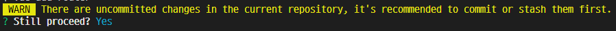
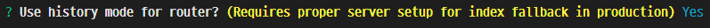
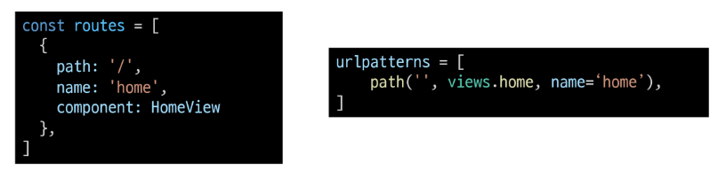

- [1. Vue Router](#1-vue-router)
  - [1.1. Routing](#11-routing)
    - [1.1.1. Routing in SSR](#111-routing-in-ssr)
    - [1.1.2. Routing in CSR / SPA](#112-routing-in-csr--spa)
  - [1.2. Vue Router](#12-vue-router)
    - [1.2.1. Vue Router Start](#121-vue-router-start)
  - [1.3. Structure of Vue Router Related Files](#13-structure-of-vue-router-related-files)
    - [1.3.1. App.vue](#131-appvue)
    - [1.3.2. router/index.js](#132-routerindexjs)
    - [1.3.3. src/views/](#133-srcviews)
- [2. URL Navigation](#2-url-navigation)
  - [2.1. Declarative Navigation](#21-declarative-navigation)
  - [2.2. Programmatic Navigation](#22-programmatic-navigation)
  - [2.3. Dynmaic Route Matching](#23-dynmaic-route-matching)
    - [2.3.1. Declare a Varibale](#231-declare-a-varibale)
    - [2.3.2. Pass a Variable](#232-pass-a-variable)
    - [2.3.3. Receive a Variable](#233-receive-a-variable)
- [3. Navigation Guard](#3-navigation-guard)
  - [3.1. Global Guard](#31-global-guard)
  - [3.2. Router Guard](#32-router-guard)
  - [3.3. Component Guard](#33-component-guard)
- [4. 404 Not Found](#4-404-not-found)
  - [4.1. URL Not Matched](#41-url-not-matched)

---

# 1. Vue Router

## 1.1. Routing

Originally, routing is the process of **selecting the best path** to send communication data within a network

**Routing in web service**  
Routing or router in web development is a <mark>mechanism where HTTP requests are routed to the suitable code</mark> that handles them.

### 1.1.1. Routing in SSR

The server executes the code only for valid url requests, and responds to the completed HTML as needed.

### 1.1.2. Routing in CSR / SPA

After the server provides only one HTML, JavaScript sends AJAX the request. Therefore, there is **only one server-side url requesting HTML documents.**

**Why should url be changed?**  
Technically, there is no problem with the operation, but there are the following inconveniences.

- There is no information about the current redering status of the page.
  - Return to the default page for the first time when page refreshes
  - Only the default page can be shared through link
- Browser's Backward feature is not available

## 1.2. Vue Router

It's the tool providing **url routing feature on the SPA**, so that SPA works like MPA(Multiple Page Application)

### 1.2.1. Vue Router Start

```
vue create {folder_name}    // Create a Vue project

cd {folder_name}            // Change directory to the created folder

vue add router              // Apply Vue router to the Vue project
```

**Alert**

-   
  Just recommend you to commit before processing
-   
  Hash mode is the mode that shows url as we normally use. Also You can track url visit records.

## 1.3. Structure of Vue Router Related Files

### 1.3.1. App.vue

```html
<template>
  <div id="app">
    <nav>
      <router-link to="/">Home</router-link> |
      <router-link to="/about">About</router-link>
    </nav>
    <router-view />
  </div>
</template>
```

- **router-link**
  - Although it is expressed as **\<a>** in DOM. But it's not the same because it doesn't reload the whole page
  - When the tag is clicked, it routes the page to the url specified in 'to' attribute
- **router-view**
  - Specifies where the components mapped to routes will be rendered

### 1.3.2. router/index.js

Where **Vue rotuer related information** is written. In particular, there is a `routes` array which elements are [**route object**](https://im-nc2u.tistory.com/entry/Vue-Router-Router-%EC%9D%B8%EC%8A%A4%ED%84%B4%EC%8A%A4%EC%99%80-Route-%EA%B0%9D%EC%B2%B4-%EB%B9%84%EA%B5%90). Route object has properties including a url and a component, which means a url and a component are matched. It's similar to Django's urls.py file.



- **Route Object**
  - **path**
    - a url
  - **name**
    - a distinguisable name of the route object
  - **component**
    - a component

* **lazy-loading**
  ```js
  component: () => import('../views/AboutView.vue')
  ```
  - ['lazy-loading'](https://kyounghwan01.github.io/blog/Vue/vue/lazy-loading/#%E1%84%8B%E1%85%B5%E1%84%80%E1%85%A5%E1%86%BA%E1%84%8B%E1%85%B3%E1%86%AF-%E1%84%92%E1%85%A1%E1%84%82%E1%85%B3%E1%86%AB-%E1%84%8B%E1%85%B5%E1%84%8B%E1%85%B2) does not load components at the time of the first build, but loads components when actually approaching them. **The first loading speed is faster.**

### 1.3.3. src/views/

This folder stores Vue components like 'src/components/'. But the only difference is that this folder stores only the components mapped to the `routes` array in index.js. It's just a semantic distinction. It's recommended to name the components in this folder **to end with 'View'**.

# 2. URL Navigation

## 2.1. Declarative Navigation

Declarative navigation method can be used with \<router-link> by adding 'to' attirbute.

```html
<template>
  <div id="app">
    <nav>
      <router-link to="/">Home</router-link> |
      <router-link :to="{ name: 'home'}">Home</router-link>
    </nav>
    <router-view />
  </div>
</template>
```

- **to**
  - insert the url to be routed
- **:to**
  - insert the object with the 'name' key announced in `routes` array.

## 2.2. Programmatic Navigation

Programmatic navigation uses a [Router object](https://im-nc2u.tistory.com/entry/Vue-Router-Router-%EC%9D%B8%EC%8A%A4%ED%84%B4%EC%8A%A4%EC%99%80-Route-%EA%B0%9D%EC%B2%B4-%EB%B9%84%EA%B5%90)'s mehtod. `this.$router.push()` push the URL to move into the history stack, which means moving to the new url.

```html
<template>
  <div id="app">
    <nav>
      <router-link to="/">Home</router-link> |
      <button @click="toHome">Home</button>
    </nav>
    <router-view />
  </div>
</template>

<script>
  export default {
    name: 'App',
    methods: {
      toHome() {
        this.$router.push({ name: 'home' })
      },
    },
  }
</script>
```

- **router.push()**
  - receives **an object with the name of the target Route object** as a argument.

## 2.3. Dynmaic Route Matching

You can use part of url as a variable.

### 2.3.1. Declare a Varibale

```js
const routes = [
  {
    path: '/hello/:userName',
    name: 'hello',
    component: MovieView,
  },
]
```

- add **' : '** in front of the string that you want to announce as a vairable.

### 2.3.2. Pass a Variable

```html
<template>
  <div id="app">
    <nav>
      <router-link :to="{ name: 'home', params: { userName: 'Harry'}}"
        >Hello</router-link
      >
      <button @click="toHello">Hello</button>
    </nav>
    <router-view />
  </div>
</template>

<script>
  export default {
    name: 'App',
    methods: {
      toHello() {
        this.$router.push({ name: 'hello', params: { userName: 'Harry' } })
      },
    },
  }
</script>
```

- Add a 'params' key in the original object. and the 'params' has an object of parameters as the value.

### 2.3.3. Receive a Variable

```html
<template>
  <div>
    <h1>Hello, {{ $route.params.userName }}</h1>
    <h1>Hello, {{ userName }}</h1>
  </div>
</template>

<script>
  export default {
    name: 'Hello',
    data() {
      return {
        userName: this.$route.params.userName,
      }
    },
  }
</script>
```

- You can get variables by **accessing the Route object**.

# 3. Navigation Guard

Setting logic that occurs **when url changes**

## 3.1. Global Guard

Works across the App

```js
const router = new VueRouter({
  mode: 'history',
  base: process.env.BASE_URL,
  routes,
})

router.beforeEach((to, from, next) => {
  console.log('to', to)
  console.log('from', from)
  console.log('next', next)
  next()
})

export default router
```

- **router.beforeEach(to, from ,next)**  
  The inner logic is exucted each time you move from one Route object to another
  - **to**  
    information about the route to move
  - **from**  
    inforamtion about the current route
  - **next**
    - **If the beforeEach function is declared, route conversion occurs only when the 'next()' is executed**
    - receives a route object as an argument

## 3.2. Router Guard

Works for the specific route

```js
const routes = [
  {
    path: '/login',
    name: 'login',
    component: LoginView,
    beforeEach(to, from, next) {
      if (isLoggined === true) {
        console.log('loggined')
        next({ name: 'home' })
      } else {
        next()
      }
    },
  },
]
```

- **beforeEnter(to, from ,next)**  
   The inner logic is exucted each time you move to the route object
  - **to**  
    information about the route to move
  - **from**  
    inforamtion about the current route
  - **next**
    - **If the beforeEnter function is declared, route conversion occurs only when the 'next()' is executed**
    - receives a route object as an argument

## 3.3. Component Guard

Detects parameters change of url corresponding to component path

```html
<script>
  export default {
    name: 'HelloView',
    data() {
      return {
        userName: this.$route.params.userName,
      }
    },
    beforeRouteUpdate(to, from, next) {
      this.userName = to.params.userName
      next()
    },
  }
</script>
```

- **beforeRouteUpdate(to, from ,next)**  
  Even if there is no change in the route object, internal logic is executed if the url address is changed.
  - **to**  
    information about the route to move
  - **from**  
    inforamtion about the current route
  - **next**
    - **If the beforeEnter function is declared, route conversion occurs only when the 'next()' is executed**
    - receives a route object as an argument

# 4. 404 Not Found

When there's no matching url. Vue just doesn't render the \<router-view> tag. Therfore additional code is required.

## 4.1. URL Not Matched

**views/NotFound404.vue**

```html
<template>
  <div>
    <h1>404 Not Found</h1>
  </div>
</template>

<script>
  export default {
    name: 'NotFound404',
  }
</script>
```

**router/index.js**

```js
const routes = [
  ...{
    path: '/404',
    name: 'NotFound404',
    component: NotFound404,
  },
  ...// All the urls not matched above will be redirected to NotFound404
  {
    path: '*',
    name: '/404',
    component: NotFound404,
  },
]
```
